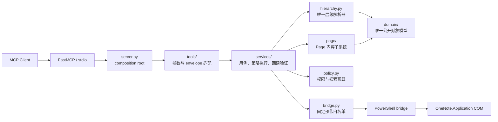
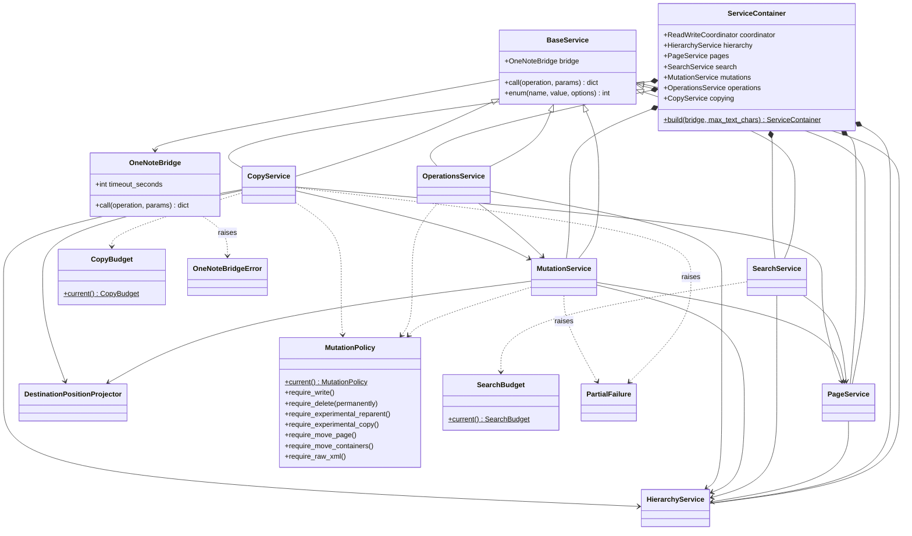
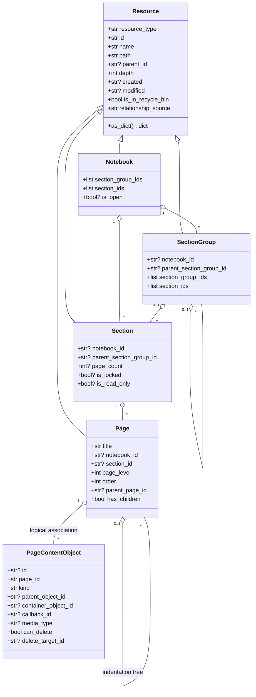
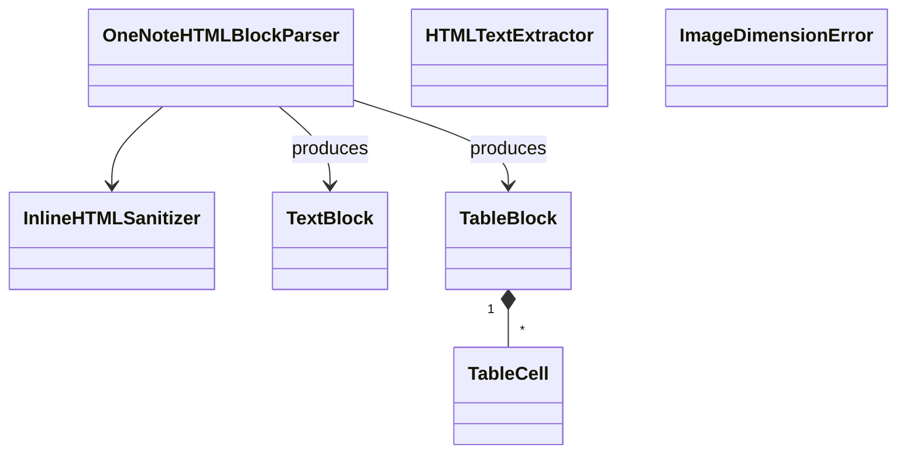
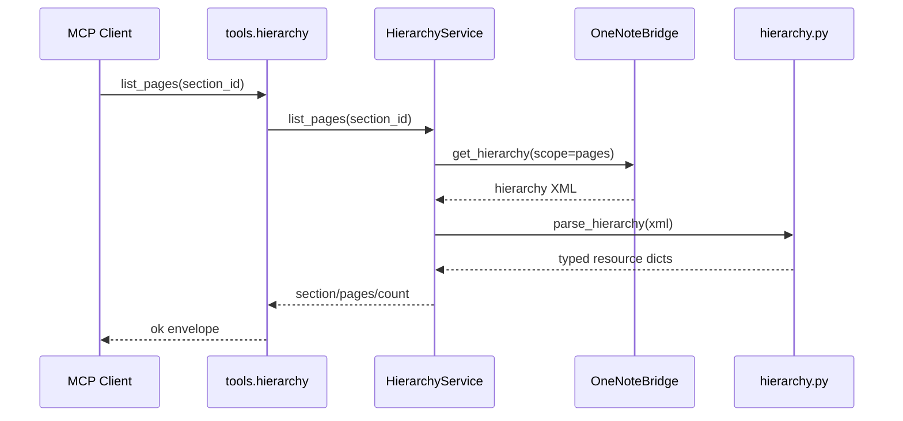
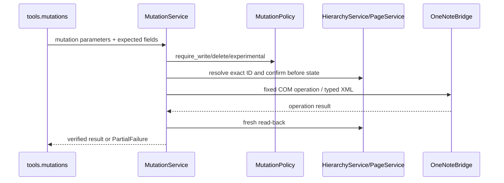

# Local OneNote MCP 当前设计架构

> 状态：当前实现态
> 更新日期：2026-08-13
> 相关契约：[对象模型](object_model.md) · [层级解析器](hierarchy_parser.md) · [工具参数与返回格式](tool_contracts.md) · [Windows Fixture Cache 路径配额目标设计](windows_fixture_cache_path_budget.md)

## 1. 架构结论

项目采用“装配入口 → MCP 工具适配层 → 应用服务层 → mapper/领域模型 → COM bridge”的分层结构。`server.py` 只创建对象和注册工具；业务规则不再放在 server 中。



必须保持的边界：

- `domain/` 是 Notebook、SectionGroup、Section、Page、PageContentObject 的唯一静态模型；服务层和工具层不得复制 DTO。
- `hierarchy.py` 是层级 XML 的唯一解析入口；`page/` 只解析 Page 内容 XML。
- `tools/` 只做同步服务到 async MCP 的适配和统一响应，不直接调用 COM。
- `services/` 承担用例编排、策略检查、XML 构造调用和 mutation 回读验证。
- `bridge.py` 不理解领域对象，只接受固定 operation 和 JSON 参数。

## 2. 源码结构与依赖方向

```text
src/local_onenote_mcp/
├─ server.py                 依赖装配与 FastMCP 启动
├─ tools/
│  ├─ context.py             当前 ServiceContainer 绑定
│  ├─ responses.py           ok/error/caught/invoke envelope
│  ├─ system.py              健康检查、标识符、特殊目录
│  ├─ hierarchy.py           层级 List/Get/Query/Path/Tree
│  ├─ pages.py               Page 内容读取与 Search
│  ├─ mutations.py           typed Create/Update/Delete
│  ├─ copying.py             P2 Copy/Page Move
│  ├─ operations.py          Export/导航/Sync/Close
│  ├─ advanced.py            启动时可选的开发 profile
│  └─ __init__.py            默认/高级工具集合和注册
├─ services/
│  ├─ base.py                BaseService
│  ├─ container.py           ServiceContainer
│  ├─ coordination.py        进程内读写协调与 cache generation hook
│  ├─ convergence.py         deadline/连续稳定观察
│  ├─ reconciliation.py      mutation 后置状态对账
│  ├─ hierarchy.py           HierarchyService
│  ├─ pages.py               PageService
│  ├─ search.py              SearchService
│  ├─ mutations.py           MutationService
│  ├─ copying.py             CopyService
│  ├─ operations.py          OperationsService
│  └─ errors.py              PartialFailure
├─ domain/
│  ├─ resource.py            Resource
│  ├─ notebook.py            Notebook
│  ├─ section_group.py       SectionGroup
│  ├─ section.py             Section
│  ├─ page.py                Page
│  ├─ page_content.py        PageContentObject/content_objects
│  └─ __init__.py            对象模型 facade
├─ hierarchy.py              纯层级 XML mapper 与定位函数
├─ page/
│  ├─ parser.py              Page XML 读取
│  ├─ formatting.py          plain/HTML/Markdown 规范化
│  ├─ builder.py             UpdatePageContent XML 构造
│  ├─ images.py              图片尺寸读取与等比换算
│  ├─ models.py              Page 格式化内部块模型
│  └─ __init__.py            Page 子系统 facade
├─ bridge.py                 PowerShell/COM infrastructure adapter
├─ onenote_errors.py         typed HRESULT/backend errors
├─ policy.py                 MutationPolicy 与 SearchBudget
├─ settings.py               server 名称、超时和文本长度配置
└─ constants.py              COM enum、namespace、schema
```

允许的主依赖方向为：

```text
server → tools → services → hierarchy/page/policy → domain
                           └──────────────────────→ bridge → COM
```

反向依赖被禁止。例如 `domain/` 不导入 service，`hierarchy.py` 不导入 bridge 或 MCP，service 不导入 tool。

## 3. 类关系总览

### 3.1 应用与基础设施类



| 类 | 所在模块 | 职责 |
| --- | --- | --- |
| `ServiceContainer` | `services.container` | 构造并持有共享 bridge 上的六个 service；表达显式依赖。 |
| `BaseService` | `services.base` | 透传 typed bridge error，并提供 enum 校验。 |
| `ReadWriteCoordinator` | `services.coordination` | 允许纯读共享；mutation 从 confirmation 到稳定回读持有独占权。writer 等待有界，异常必释放；generation/invalidator 是 TODO 024 cache 的接入点。 |
| `ConvergenceResult` | `services.convergence` | 用 monotonic deadline、可注入 clock/sleeper、连续稳定观察和 content-free history 表达 read-after-write 收敛。 |
| `ReconciliationResult` | `services.reconciliation` | 将 live 后置状态分类为 `not_applied/applied/partially_applied/indeterminate`；仅精确 pre-state 且 typed retryability 允许时有界重放一次幂等动作。 |
| `HierarchyService` | `services.hierarchy` | 获取 typed snapshot，完成 List/Get/Query/Path/Tree、ID/路径解析、层级更新 XML。 |
| `PageService` | `services.pages` | 读取 Page XML/text/object/binary，确认 Page，计算内容摘要。 |
| `SearchService` | `services.search` | 以 root 或一个精确 Notebook/SectionGroup/Section 为原生 COM 起点执行 index-only `FindPages`；一次调用共享 hierarchy catalog、候选预算、当前页 hydration 和总耗时预算。 |
| `MutationService` | `services.mutations` | typed 创建、修改、删除；策略检查、乐观确认和操作后回读均在此。 |
| `CopyService` | `services.copying` | 无状态 Copy 计划、默认单页/显式 Page 子树范围、递归容器复制、Page XML 保真报告和 Move 删除门。 |
| `OperationsService` | `services.operations` | 特殊目录、超链接、父级、导出、导航、同步、关闭及高级应用操作。 |
| `MutationPolicy` | `policy` | 从环境变量生成不可变权限快照。 |
| `SearchBudget` | `policy` | 从环境变量生成不可变搜索预算。 |
| `CopyBudget` | `policy` | 限制 Copy 的对象/Page 数、完整 XML 字节和计划/执行时间。 |
| `OneNoteBridge` | `bridge` | 通过临时 JSON 与固定 PowerShell 脚本执行白名单 COM 操作。 |
| `PartialFailure` | `services.errors` | 携带非原子多步 mutation 已完成步骤。 |
| `OneNoteError` | `onenote_errors` | 保留 operation、最内层 signed/unsigned HRESULT、content-free category、retryability、partial 和 reconciliation；bridge audit 另记 PowerShell wrapper HRESULT、异常深度和最内层异常类型。按 Microsoft OneNote error table 分类 modal、not-yet-synchronized、timeout、object/file unavailable，未知值保持 fail-closed。 |

`ServiceContainer.build()` 的创建顺序体现了依赖：先 `HierarchyService`，再 `PageService`，随后 `SearchService` 和 `MutationService`，最后创建依赖 mutation 的 `OperationsService` 与 `CopyService`。

### 3.2 COM 收敛与进程内协调

所有公开 Tool 都在 `tools.responses.invoke` 进入同一个进程级协调器。纯读调用取得共享 lease；mutation 从 confirmation 开始，跨越 cache invalidation/generation、COM execute、reconciliation 和连续稳定 read-back，直到成功或 fail-closed 分类完成才释放独占 lease。首版不承诺跨 MCP 进程、用户在 Desktop 中的直接编辑或 OneNote 自身同步被事务化。

默认 convergence 合同为 4 秒 monotonic deadline、0.5 秒观察间隔、最多 16 次观察，并至少要求两个连续、accepted 且 stable identity 相同的 live 观察。history 只记录 attempt/accepted/stable 和 typed transient category，不保存 Page XML、正文、binary、路径或请求参数。异常默认立即传播；只有调用点显式提供 transient predicate，且 typed HRESULT 属于 not-yet-synchronized、timeout 或 read-only object/file unavailable 时才延迟重读。Create 的 stable identity 包含 allocated→resolved ID；Page mutation 使用内容摘要；Reorder/Reparent/Copy 使用各自业务层定义的 topology/fidelity projection；Delete/Close 使用活动态或 open-state 后置条件。

COM error 不等于 mutation 未发生。`reconciliation.py` 先读 live 状态：postcondition 已成立即按 `applied` 继续收敛；精确 pre-state 且操作声明为幂等、错误类型允许重试时最多重放同一目标一次；部分变化或不可读状态返回 partial/indeterminate。只有 `hrNotYetSynchronized (0x8004201D)` 与 `hrTimeOut (0x80042023)` 可进入幂等 mutation 重放判断；object/file unavailable 只属于 read-after-delay，不能证明 mutation 可重放。Modal UI (`0x80042030`) 只提示用户关闭阻塞对话框，绝不自动重放副作用 mutation。

OneNote COM 不提供只读的 mutation-ready predicate。稳定 live preflight 只能证明 `logical_ready`，不能从 `SyncHierarchy` accepted、可读 Page XML、文件属性或固定等待推导下一次 native mutation 必然成功。正确的状态流是“logical preflight → operation policy 允许的单次/有界 execute → live reconciliation → stable postcondition”；disposable close/reopen checkpoint 是 lifecycle 特例，不属于生产业务 tool 的隐式权限。完整状态模型与当前/目标实现边界见 [`mutation_readiness_and_call_design.md`](mutation_readiness_and_call_design.md)。

### 3.3 领域类



这些 dataclass 只在 mapper 内表达白名单字段，再通过 `as_dict()` 进入服务和 MCP 边界。Page 的公开名称是 `title`，其 `as_dict()` 不保留继承来的 `name` alias。`PageContentObject` 属于 Page 内容快照，不进入层级树。

### 3.4 Page 内部类



- `InlineHTMLSanitizer` 删除不安全 tag/attribute/style。
- `OneNoteHTMLBlockParser` 把 HTML 转成有序文本块和表格块。
- `HTMLTextExtractor` 从 Page XML 的内嵌 HTML 提取可见文本。
- `TextBlock/TableCell/TableBlock` 是 builder 使用的内部格式模型，不是公开对象模型。
- `ImageDimensionError` 表达不受支持或损坏的图片头。

## 4. MCP 工具适配层

`tools/` 当前由模块级 async 函数组成，不引入“工具类”。`tools.context` 在启动时绑定一个 `ServiceContainer`；每个工具读取对应 service，调用同步用例，再由 `responses.invoke()` 转为统一 envelope。

| 工具模块 | 默认注册数 | 调用的 service |
| --- | ---: | --- |
| `tools.system` | 3 | hierarchy、operations |
| `tools.hierarchy` | 11 | hierarchy |
| `tools.pages` | 6 | pages、search |
| `tools.mutations` | 20 | mutations |
| `tools.copying` | 7 | copying |
| `tools.operations` | 7 | operations |
| 合计 | 54 | — |

`tools.advanced` 另有 6 个开发 profile 工具，仅当进程启动时 `LOCAL_ONENOTE_ENABLE_RAW_XML=true` 才注册。注册并不代表取得写权限；service 仍会再次执行 write/delete/raw policy。公开 `update_hierarchy_xml` 已从所有生产 profile 移除，内部 bridge `update_hierarchy` 只由受约束 service 编排。逐工具合同见 [Advanced/低层操作](advanced_operations.md)。

响应映射：

| Python 异常 | MCP `code` |
| --- | --- |
| `ValueError` | `validation_error` |
| `PermissionError` | `policy_disabled` |
| `PartialFailure` | `partial_failure`，附带 `partial/completed_steps` |
| 其他 service/bridge 异常 | `backend_error` |

## 5. 关键调用链

### 5.1 只读层级查询



### 5.2 typed mutation



Mutation 使用 ID 作为主键；`expected_name/expected_title`、父 ID 和可选 modified 是乐观确认字段。写后必须验证同 ID、名称、父级、顺序或内容摘要。`replace_page_body` 是明确的非原子多步操作。

### 5.3 Search

- 公开路径固定为 `onenote_index`：严格 `root/start_node` scope → 单次完整 typed catalog → 一个 COM `FindPages` → 按 Page ID 补全并证明范围归属 → 候选预算检查 → `offset/page_size` 切片 → 仅对当前页可选 hydration snippet。
- root 使用空 `start_id`；start node 只接受精确、属于已打开 Notebook 的 Notebook/SectionGroup/Section ID。范围外、关闭 Notebook、无法证明归属和不符合回收站参数的结果被过滤。
- 分页标记为 `live_index`，每页重新执行 `FindPages`，不冻结跨页快照。候选预算默认 1000 且先于分页；页大小默认/最大 200。
- `local_text_search` 暂作无公开入口的内部实现，不出现在 Tool、health、环境选择或失败 fallback 中。
- 两个后端不会静默 fallback。

## 6. 运行时生命周期与并发

- `server.py` 创建一个 `FastMCP`、一个 `OneNoteBridge` 和一个 `ServiceContainer`，随后注册工具并运行 stdio。
- service 实例共享同一个 bridge；当前没有 repository 或 hierarchy cache。
- 每个 bridge 调用启动非交互 PowerShell，并在该进程中创建 OneNote COM 对象。
- 工具函数是 async transport 接口，service 和 bridge 当前为同步阻塞执行。
- mutation 回读使用有限次数的同步轮询；搜索顺序读取 Page，不并行调用 COM。

## 7. 测试与写入隔离

| 测试文件 | 主要边界 | 自动运行权限 |
| --- | --- | --- |
| `test_domain.py` | dataclass 序列化 | 纯内存、只读 |
| `test_hierarchy.py` | 层级 XML mapper | 纯字符串、只读 |
| `test_page.py` | Page parser/formatter/builder | 纯内存/本地 fixture、只读 |
| `test_policy.py` | policy/budget | 纯环境快照、只读 |
| `test_server.py` | tool/service 集成 | 默认只读；写合同标记 `write_contract` |

本会话与默认自动验证仅运行 `pytest -m "not write_contract"`。真实 COM mutation 以及 `write_contract` 流程只能按 [隔离 mutation 验证](../dev/isolated_mutation_validation.md) 人工触发。

Manual-validation fixture 架构位于生产 MCP 之外，但同样遵守 local-only 与 fail-closed 边界。每个公开 Scenario 唯一拥有一个 `RecipeBase`；Recipe 用有序 Notebook role 集合、完整 profile/manifest/validator 声明构建稳定 cache identity。公共 cache runtime 独占 index、锁、opaque copy、byte inventory、publish、materialize 和精确失效清理；working identity 只由各 run 的 lifecycle lease 管理，Recipe 本身不得执行文件系统或 lifecycle 操作。

Windows 普通路径现统一执行 240 UTF-16 code units 的确定性 preflight；component、opaque relative path、role、working name 和 64-unit run evidence leaf 另有更窄上限。完整 64-hex fingerprint 与 logical instance identity 保留在 entry/index/lock/evidence，磁盘定位使用 32-hex fingerprint key，以及 `instances/p` 或 `instances/a/<1..24 hex>`。Publish/materialize staging 分别使用 `.s-<16 hex>` 与 `.m-<16 hex>`，JSON/XML 原子临时文件同样使用 16-hex nonce。Runtime 不使用 `\\?\` extended-length path，不依赖 `LongPathsEnabled`；所有源 inventory、最终 cache、staging、working、artifact 与原子临时路径都在 copy、publish 或 COM open 前枚举验证。Opaque tree 逐层先预算再进入；authored live revalidation 核对完整 projection digest；maintenance 在 lock/只读 COM snapshot 前预算现有树与将生成的 metadata。稳定合同与预算公式见 [Windows Fixture Cache 路径配额](windows_fixture_cache_path_budget.md)，实施证据由 [TODO 021](../todo/021_windows_fixture_cache_path_budget.md) 跟踪。

旧 payload 没有 lookup、迁移或删除兼容。升级前 human-gated `clear all` 成功后，首次新 cache 初始化只可在 durable summary、空 v1 index、精确 managed roots、完整只读 open snapshot 和零旧 payload/run 全部成立时，将遗留的空 ownership marker/index 原子 stamp 为 v2；summary 后以 schema、ownership flags、`started_at` 和 mtime 证明的新 v2 run 可共存，任何旧、非空或不确定状态继续 fail closed。

该基础设施的本地文件/目录原子发布共享一个仅限 Windows `WinError 5/32` 的状态守卫重试：首次失败后按 `50/100/200/400/800ms` 有界退避，总预算约 1.55 秒；每次重试前 source 与 destination 的 `lstat` 身份必须保持不变。Cache entry 和 working directory 额外要求 destination 首次及重试期间始终不存在；多 role materialization 失败时只回收本次已成功发布的 owned paths。该重试不适用于 `copytree`、删除、COM、MCP 调用或任何 mutation，因此不构成 mutation 重试或权限放宽。

普通运行默认 fresh 且零 cache access。显式 `--use-cache` 的数据流固定为 `closed validated disposable bundle → managed immutable template → new run-scoped working bundle → exact path assertion → bounded SectionGroup/.one batch activation → manifest hierarchy double stability → typed old→live ID rebinding → current live validation → scenario mutation`。已观察到 COM 可读状态先于本地 Section 文件提交的 Recipe 可以声明版本化 `requires_persistence_checkpoint`；当前仅 `reparent-page` v3 使用它，fresh/cold-build 在首次业务 mutation 或 template publish 前执行 `CloseNotebook(force=false) → exact-path reopen → typed ID/evidence rebind → full live validation`，并把 close receipt 与 `fixture-persistence-remap.json` 留在 run 内。旧 v2 fingerprint 不会被新实现命中。Lifecycle 在第一次 child COM 调用前完成路径预算、root containment、reparse 与 typed-parent 校验并冻结请求，然后通过内部 bridge operation 在一个 PowerShell/COM session 中按 parent-before-child 打开全部容器、末尾读取一次 pages hierarchy；每个 role 最多两轮，只重试 snapshot 中仍缺失的容器。Notebook 直属 child 只使用 `absolute working path + empty relative ID`，嵌套 child 只使用 `child filename + exact parent ID`；绝对 path 与非空 parent ID 的组合被禁止。Batch 返回 ID/单次 snapshot 不能放行，全部 manifest-bound SectionGroup、Section、Page 仍须按 typed relative address 连续稳定两次，之后才执行完整内容验证与 ID rebind。OneNote 只打开 working path；template bytes 不接受 mutation、restore、keep-worksite 或失败现场回写。Cache 不保存或查询 run working lease，也不与 run 维持所有权或生命周期关系；多个 validated hit 可以从同一 immutable entry materialize 到各自唯一的 run-scoped paths，并在实际 live Notebook ID 全部互异时并存。`.local-validation` 下的短时 open lock 串行化“扫描 run-local lease—打开—绑定 live identity”，各 run 的 `lifecycle-lease*.json` 只拒绝实际 live ID/path 相交、role 内重复或尚未可靠重绑定的身份。Run-local active lease 不阻止物理独立 cache entry 的 invalidation/cleanup；后者只按实际 template path 判断 template 本身是否打开。Working-copy Notebook shell/child activation 失败属于 run-local retryable failure：保留 working Notebook、实际 live-ID lease 和诊断，关闭该 working Notebook 后可重试，不能反向污染已验证 template。地址映射缺失/歧义或 validator 失败时，exact entry 转为保留证据但不可命中的 `invalid`。InteractiveFixtureRecipe 与 UserAuthoredRecipe 只能通过各自静态注册、排除于 `all` 的 human-gated bootstrap Scenario 发布；cache-only consumer 的 miss 只返回 `interactive_bootstrap_required`。

`clear` 是生产 MCP 和 Scenario registry 之外的本地 maintenance 边界，仅公开 `runs`、`cache`、`all` 三个子 action。Dry-run 零 managed write/delete，但读取一次当前 OneNote Notebook ID/实际目录快照；真实执行只接受交互式前台 stdin，在完成安全计划后通过后续提示读取动作绑定确认值，不提供 CLI confirmation 参数，并持有同一短时 open lock。它只删除固定 `.local-validation/` 根下由 run metadata 或 cache marker/index/entry/inventory 共同证明 ownership 的精确目标，删除前写 pending receipt，删除后写 final receipt 和 summary。完整 target evidence 进入 durable summary 后，成功 `deleted` receipt 可自动压缩删除；pending/failed/unbound receipt 保留。Cache maintenance 同时移除无 payload 的 tombstone index 项，并只用逐层 `rmdir` 清理 canonical fingerprint 下可证明为空的 scaffold。Validation root、cache root/marker、summary、用户 Notebook 和任意外部路径不属于删除目标。

冲突扫描的当前调用界限是：短时 open lock 内在打开 working bundle 前后各捕获一次开放 Notebook ID/实际目录 snapshot；任意数量的历史 run-local lease 都只与该 snapshot 做内存比较，不得逐 lease 重复枚举 OneNote 或调用 `GetHierarchy`。

## 8. 已知演进边界

1. 完整层级快照会在一次复杂用例中被多次读取；若引入缓存，mutation 前确认和写后回读必须绕过缓存。
2. `tools.context` 是进程级 service 绑定，适合当前单 server 实例；多租户或多 bridge 配置需要改为显式 MCP context 注入。
3. PowerShell/COM 每次调用的延迟尚无正式基准；长驻 broker 必须先验证 COM apartment、超时和恢复语义。
4. 字典是当前 MCP 边界格式；新增 DTO 时必须复用 `domain/` 的字段契约，不能建立第二套对象模型。
5. Page、Section、SectionGroup Reparent 均为默认注册的 typed 实验工具，共用独立 Reparent 开关且只允许同一 Notebook；用户已确认三个迁移后的 typed 真实场景在当前环境全部通过，跨版本证据仍需单独积累。
