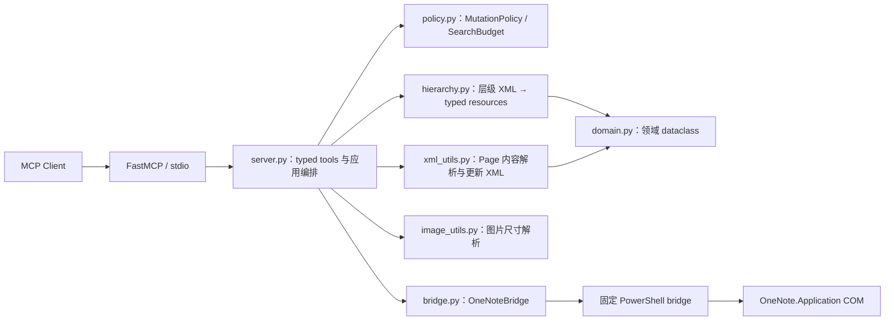
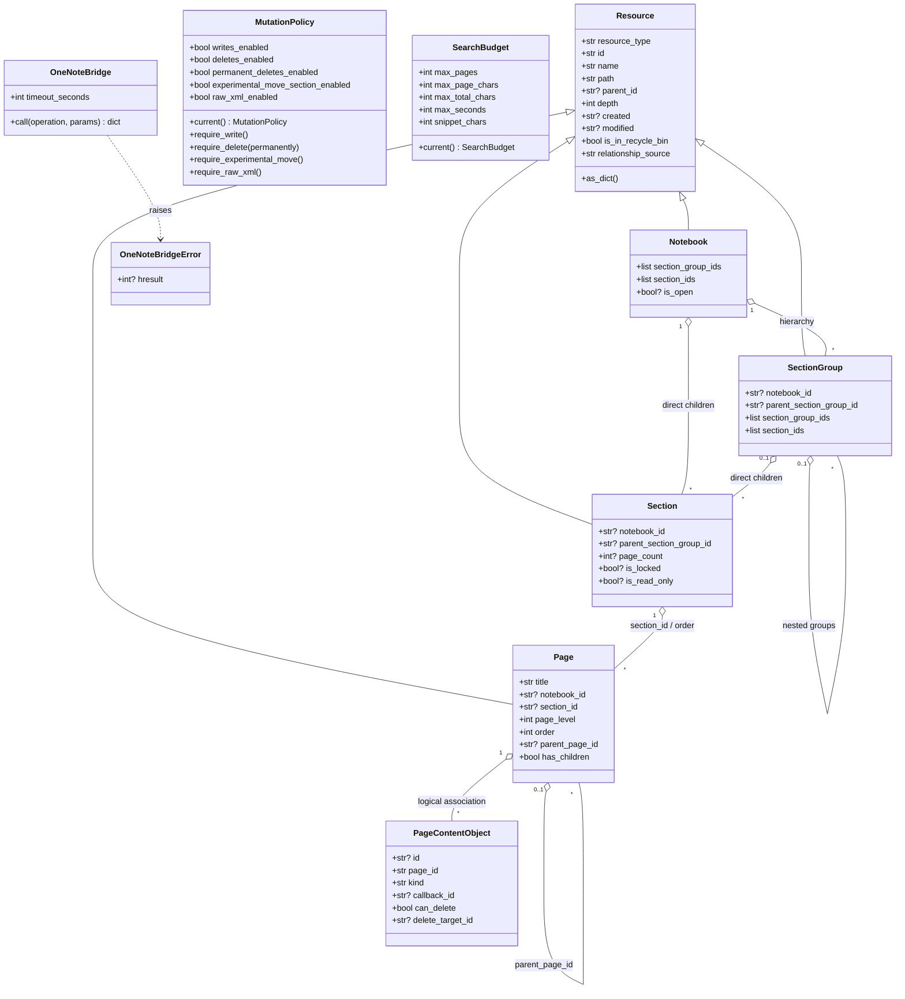
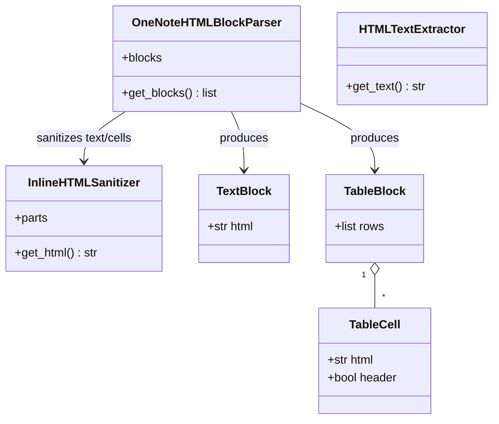
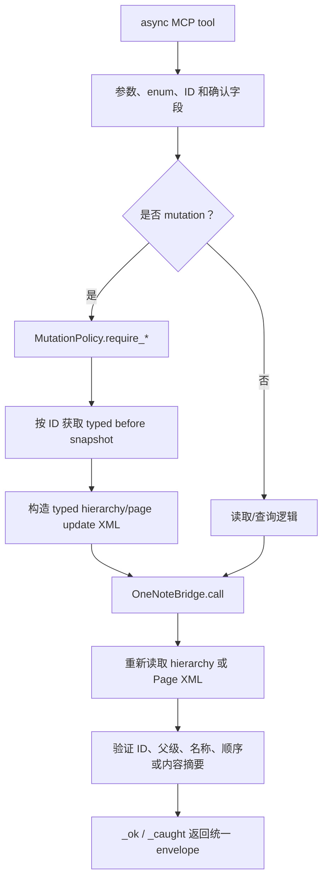
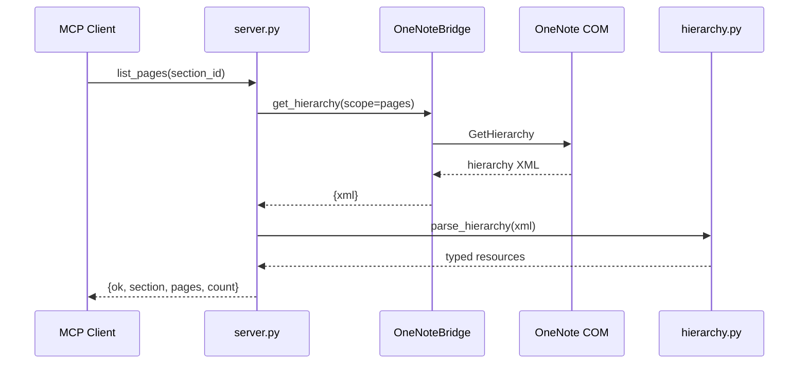

# Local OneNote MCP 当前设计架构

> 状态：当前实现态
> 更新日期：2026-08-04
> 适用版本：commit `1a1de5f` 之后

本文描述仓库当前实际架构、类、模块关系和运行时调用链。对象字段详见 [object_model.md](object_model.md)，层级解析细节见 [hierarchy_parser.md](hierarchy_parser.md)，MCP 参数与返回值详见 [tool_contracts.md](tool_contracts.md)。

## 1. 总体结构

项目采用一个轻量的分层架构：MCP 工具和应用编排集中在 `server.py`，领域对象、层级解析、Page XML、策略和 COM bridge 分别位于独立模块。



核心边界：

- `server.py` 知道所有模块，但领域和解析模块不知道 MCP 或 COM；
- `hierarchy.py` 是唯一层级解析入口；
- `xml_utils.py` 只处理 Page 内容和 Page update XML，不解析层级；
- `bridge.py` 不理解领域对象，只执行固定白名单操作；
- 写操作必须先经过 `MutationPolicy` 和对象确认，再进入 bridge。

## 2. 源码模块

```text
src/local_onenote_mcp/
├─ server.py       MCP 注册、应用服务编排、mutation 回读
├─ domain.py       稳定领域模型和 PageContentObject 规范化
├─ hierarchy.py    唯一层级解析器、关系推导和资源定位
├─ xml_utils.py    Page XML 读取/构造、HTML/Markdown 转换
├─ bridge.py       JSON 临时文件 + PowerShell + COM 白名单
├─ policy.py       写删开关和 Search 预算
├─ image_utils.py  PNG/JPEG/GIF/BMP 尺寸与比例换算
├─ constants.py    COM enum、XML namespace 和 schema 常量
└─ __init__.py     包版本
```

| 模块 | 所属层 | 主要输入 | 主要输出 |
| --- | --- | --- | --- |
| `server.py` | MCP/Application | MCP 参数 | 统一 `{ok, complete, warnings, ...}` envelope |
| `domain.py` | Domain | 已规范化字段、Page 对象中间记录 | dataclass 或稳定字典 |
| `hierarchy.py` | Mapper/Domain service | OneNote hierarchy XML | Notebook/SectionGroup/Section/Page typed 字典 |
| `xml_utils.py` | Page mapper/XML builder | Page XML、plain/HTML/Markdown | 文本、内容对象、OneNote Page update XML |
| `bridge.py` | Infrastructure adapter | 固定 operation + JSON 参数 | COM 结果字典或 `OneNoteBridgeError` |
| `policy.py` | Application policy | 环境变量 | mutation 决策和 SearchBudget |
| `image_utils.py` | Utility | 本地图片头和目标尺寸 | 原始或等比尺寸 |
| `constants.py` | Infrastructure constants | 字符串 enum | OneNote COM 数值 enum |

## 3. 类及其关系



### 3.1 领域类

领域类全部位于 `domain.py`，使用 dataclass 表达静态字段：

| 类 | 继承/关系 | 职责 |
| --- | --- | --- |
| `Resource` | 基类 | 定义四层对象共有字段和 `as_dict()`。 |
| `Notebook` | `Resource` | 表达打开状态和直属 SectionGroup/Section ID。 |
| `SectionGroup` | `Resource` | 表达所属 Notebook、父组及直属子项。 |
| `Section` | `Resource` | 表达父组、Page 数和只读/锁定状态。 |
| `Page` | `Resource` | 表达标题、Section、顺序和缩进树；序列化时不暴露旧 `name` alias。 |
| `PageContentObject` | 与 Page 逻辑关联 | 表达 Outline、Image、Attachment 等 Page 内对象，不嵌入普通 Page metadata。 |

这些 dataclass 是解析时的字段约束。当前 MCP 边界传输的是 `as_dict()` 结果，而不是 dataclass 实例。

### 3.2 策略类

- `MutationPolicy`：不可变配置快照。`current()` 每次从环境读取开关，避免工具绕过运行时策略；`require_*` 失败时抛出 `PermissionError`，由 server 转为 `policy_disabled`。
- `SearchBudget`：不可变 Search 限额快照，控制候选 Page、单页字符、总字符、耗时和 snippet 长度。

### 3.3 基础设施类

- `OneNoteBridge`：不可变 COM adapter。每次 `call()` 创建请求/响应 JSON 临时文件，启动非交互 PowerShell，执行固定 `POWERSHELL_BRIDGE`，读取 JSON 后清理临时文件。
- `OneNoteBridgeError`：封装 PowerShell 失败、COM 错误和超时，可保存 HRESULT；server 将其转换为 `RuntimeError/backend_error`。当前不会返回 HRESULT，但错误 message 仍可能包含 COM 提供的文本。
- `ImageDimensionError`：图片头不受支持或损坏时由 `image_utils.py` 抛出。

### 3.4 Page 内容转换类



| 类 | 职责 |
| --- | --- |
| `InlineHTMLSanitizer` | HTMLParser 子类；保留允许的 inline tag/style/link，移除 script/style 和不安全属性。 |
| `OneNoteHTMLBlockParser` | 将 HTML 拆成有序 TextBlock/TableBlock；OneNote table 必须生成为原生 `one:Table`。 |
| `HTMLTextExtractor` | 从 `one:T` 内嵌 HTML 提取可见纯文本。 |
| `TextBlock` | 一个已净化文本块。 |
| `TableCell` | 原生 OneNote table cell 的 HTML 和 header 标记。 |
| `TableBlock` | 二维 TableCell 列表。 |

## 4. 层级解析器与领域模型

`hierarchy.py` 本身不定义状态类，而是提供一组纯函数：

1. `parse_hierarchy()` 读取 XML tag 和白名单 attribute；
2. 创建 `Notebook/SectionGroup/Section/Page` dataclass，再立即序列化为稳定字典；
3. `_complete_relationships()` 补直属子 ID 和 Page count；
4. `_derive_page_tree()` 根据同 Section 的 `order/page_level` 推导 Page 父子关系；
5. `resolve_resource()`、`find_resource_by_*()`、`filter_resources()` 对 typed snapshot 操作。

FindPages/FindMeta 返回局部 XML 时，`parse_hierarchy(xml, catalog=full_snapshot)` 用命中 ID 从完整 snapshot 回填路径和关系，避免局部 XML 冒充完整树。

## 5. Server 应用编排

`server.py` 当前不是 class-based service；它由 FastMCP 实例、一个进程级 `OneNoteBridge` 实例以及一组私有应用函数和 async tool 函数组成。



私有函数可以按职责分为：

- bridge facade：`_bridge/_hierarchy_xml/_page_xml`；
- typed snapshot：`_domain_items/_domain_item/_resolve_resource`；
- mutation guard：`_confirm_item/_confirm_page`；
- read-back：`_wait_domain_item/_wait_created_domain_item`；
- hierarchy XML builder：`_hierarchy_update_xml/_section_move_xml/_page_order_update_xml`；
- Search service：`_local_text_search`；
- response mapper：`_ok/_error/_caught`。

默认 profile 注册 43 个 typed 工具。`_advanced_tool` 只在 server 启动时检测到 `LOCAL_ONENOTE_ENABLE_RAW_XML=true` 才注册 raw/legacy 开发工具；运行时仍要通过 write/delete policy。

## 6. 典型调用链

### 6.1 层级读取



### 6.2 Page 内容更新

```text
append_to_page
  → MutationPolicy.require_write
  → _confirm_page（ID/title/section/modified）
  → GetPageContent + 内容摘要
  → xml_utils.build_page_update_xml
  → OneNoteBridge(update_page_content)
  → GetPageContent + 新摘要
  → typed Page 回读
  → 成功 envelope
```

### 6.3 Search

- `local_scan`：完整 typed hierarchy → 显式 scope 过滤 → 候选数硬检查 → 逐页读取且受 SearchBudget 约束；
- `onenote_index`：COM FindPages → 局部 XML → 完整 catalog hydration → 可选读取命中 Page 生成 snippet；
- 两种后端不会静默互相 fallback。

## 7. 数据与错误边界

| 边界 | 约束 |
| --- | --- |
| MCP → server | mutation 使用精确 ID；名称/路径解析只用于只读辅助。 |
| server → policy | 写、删、永久删除、实验 Move、raw XML 分开授权。 |
| server → hierarchy | 只传 XML/catalog，不传 bridge 或 MCP context。 |
| server → bridge | operation 必须属于 PowerShell switch 白名单；用户输入只进入 JSON。 |
| bridge → PowerShell | 请求/响应通过临时 JSON 路径环境变量交换，不插值到脚本文本。 |
| server → MCP | 成功和失败使用固定 envelope；未知 COM attribute 不公开；bridge message 当前可能作为 `backend_error.error` 返回。 |

## 8. 生命周期与并发模型

- MCP server 通过 stdio 长驻；`mcp` 和 `bridge` 是模块级单例；
- 每次 bridge 调用创建一个 PowerShell 进程和一个新的 `OneNote.Application` COM 对象；
- 当前没有 hierarchy cache、repository 或长驻 COM broker；每个 typed lookup 通常重新读取完整 hierarchy；
- mutation read-back 采用有限重试和同步 `time.sleep`；工具函数虽为 async，底层 bridge 仍是同步阻塞调用；
- Search 当前顺序读取 Page，没有并行 COM 调用。

这些是当前实现事实，不代表目标架构承诺。

## 9. 当前技术债与后续演进边界

1. `server.py` 同时承担 MCP 注册、应用服务和部分 hierarchy mutation XML builder，体积较大；后续可拆为 `tools/` 与 `services/`，但不得重新引入第二套对象模型。
2. `OneNoteBridge` 每次启动 PowerShell/COM，延迟和资源消耗尚无基准；长驻 broker 必须先验证 COM apartment、超时和恢复语义。
3. 层级 snapshot 未缓存，同一工具内可能多次读取完整 hierarchy；若增加缓存，mutation 前确认和操作后回读必须强制绕过缓存。
4. dataclass 目前在 mapper 内短暂存在，MCP 边界仍使用可变字典；未来可引入显式 DTO，但字段必须保持与对象模型文档兼容。
5. `replace_page_body` 是非原子多步操作；不能通过架构命名把它描述为事务。
6. Section Move 仍是实验能力；架构层的 read-back 不能替代特定 OneNote 版本的隔离验证。

## 10. 测试分层

| 测试文件 | 覆盖层 | 是否访问 OneNote |
| --- | --- | --- |
| `test_domain.py` | 领域序列化和关系字段 | 否 |
| `test_hierarchy.py` | 完整/局部层级 XML、hydration、解析歧义 | 否 |
| `test_xml_utils.py` | Page XML、HTML/Markdown、table、内容对象 | 否 |
| `test_policy.py` | 环境开关和 SearchBudget | 否 |
| `test_server.py` | MCP 应用编排和 mock bridge 合同 | 默认只读；mutation 测试标记为 `write_contract` |

真实 COM mutation 只能按照 `docs/dev/isolated_mutation_validation.md` 人工触发，不属于默认测试或 CI。
