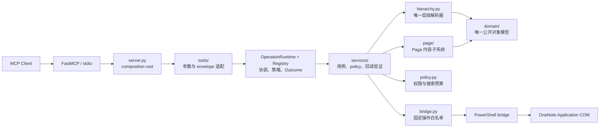
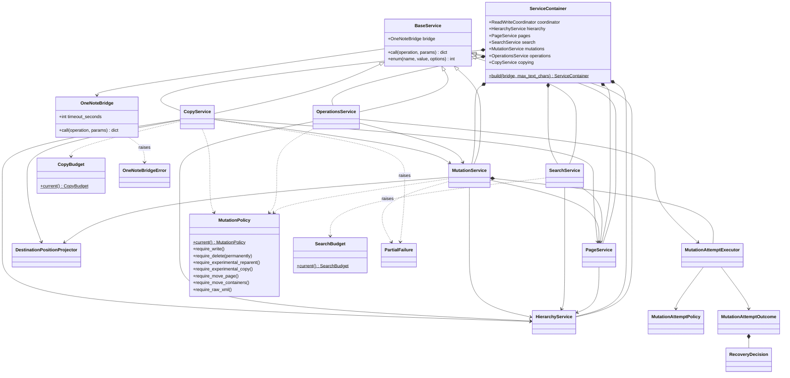
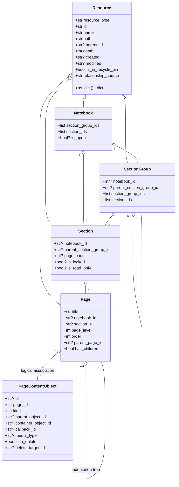
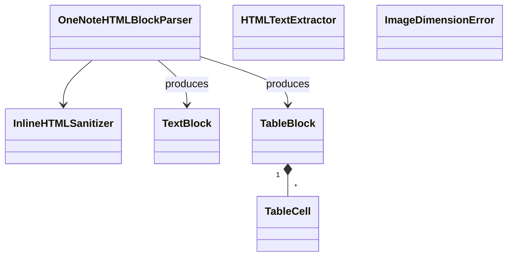
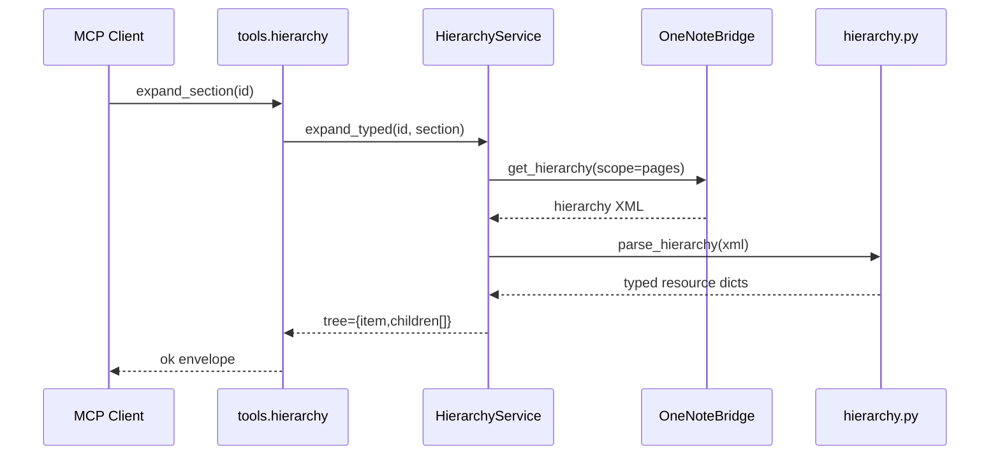
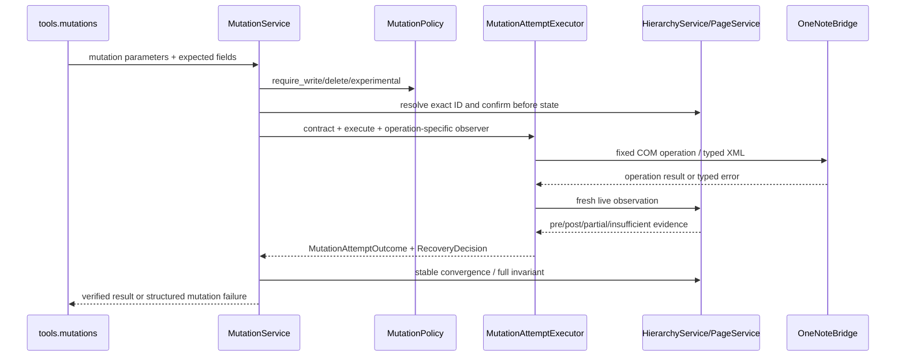

# Local OneNote MCP 当前设计架构

> 状态：当前实现态
> 更新日期：2026-08-15
> 相关契约：[Operation Runtime](operation_runtime.md) · [对象模型](object_model.md) · [层级解析器](hierarchy_parser.md) · [工具参数与返回格式](tool_contracts.md) · [Windows Fixture Cache 路径配额目标设计](windows_fixture_cache_path_budget.md)

## 1. 架构结论

项目采用“装配入口 → MCP 工具适配层 → Operation Control Plane → 应用服务层 → mapper/领域模型 → backend”的分层结构。`server.py` 只创建对象和注册工具；业务规则不再放在 server 中。



必须保持的边界：

- `domain/` 是 Notebook、SectionGroup、Section、Page、PageContentObject 的唯一静态模型；服务层和工具层不得复制 DTO。
- `hierarchy.py` 是层级 XML 的唯一解析入口；`page/` 只解析 Page 内容 XML。
- `tools/` 只提交 operation 名称和参数，并映射统一响应；不直接取得 Service、协调 lease 或调用 COM。
- `OperationRuntime` 和 canonical Registry 统一 operation 分类、coordination、deadline、cache generation、backend-call accounting、安全审计与 Outcome；不解释 OneNote 内容或 Copy fidelity。
- `services/` 承担用例编排、策略检查、XML 构造调用和 mutation 回读验证。
- `bridge.py` 不理解领域对象，只接受固定 operation 和 JSON 参数。

## 2. 源码结构与依赖方向

```text
src/local_onenote_mcp/
├─ server.py                 依赖装配与 FastMCP 启动
├─ operation_catalog.py      56 项 OperationSpec/Strategy/Handler 唯一 Registry
├─ tools/
│  ├─ context.py             当前 OperationRuntime 绑定
│  ├─ responses.py           Runtime invoke 与 ok/error/caught envelope
│  ├─ system.py              健康检查、标识符、特殊目录
│  ├─ hierarchy.py           层级 List/Get/Query/Path/Tree
│  ├─ pages.py               Page 内容读取与 Search
│  ├─ mutations.py           typed Create/Update/Delete
│  ├─ copying.py             P2 Copy/Page Move
│  ├─ operations.py          Export/导航/Sync/Close
│  ├─ advanced.py            无生产暴露的低层能力边界声明
│  └─ __init__.py            唯一生产工具集合和注册
├─ services/
│  ├─ base.py                BaseService
│  ├─ container.py           ServiceContainer
│  ├─ coordination.py        进程内读写协调与 cache generation hook
│  ├─ operation_runtime.py   Spec/Registry/Execution/Outcome 与分类型 Strategy
│  ├─ convergence.py         deadline/连续稳定观察
│  ├─ reconciliation.py      mutation 后置状态对账
│  ├─ mutation_control.py    有界 mutation attempt 规约、执行裁决与结果账本
│  ├─ hierarchy.py           HierarchyService
│  ├─ pages.py               PageService
│  ├─ search.py              SearchService
│  ├─ mutations.py           MutationService
│  ├─ copying.py             CopyService
│  ├─ operations.py          OperationsService
│  └─ errors.py              MutationFailure/MutationPreflightFailure/PartialFailure
├─ domain/
│  ├─ resource.py            Resource
│  ├─ notebook.py            Notebook
│  ├─ section_group.py       SectionGroup
│  ├─ section.py             Section
│  ├─ page.py                Page
│  ├─ page_content.py        PageContentObject/content_objects
│  └─ __init__.py            对象模型 facade
├─ hierarchy.py              纯层级 XML mapper 与定位函数
├─ page/
│  ├─ parser.py              Page XML 读取
│  ├─ formatting.py          plain/HTML/Markdown 规范化
│  ├─ builder.py             UpdatePageContent XML 构造
│  ├─ images.py              图片尺寸读取与等比换算
│  ├─ models.py              Page 格式化内部块模型
│  └─ __init__.py            Page 子系统 facade
├─ bridge.py                 PowerShell/COM infrastructure adapter
├─ onenote_errors.py         typed HRESULT/backend errors
├─ policy.py                 MutationPolicy 与 SearchBudget
├─ settings.py               server 名称、超时和文本长度配置
└─ constants.py              COM enum、namespace、schema
```

允许的主依赖方向为：

```text
server → tools → OperationRuntime/Registry → services → hierarchy/page/policy → domain
                                                   └──────────────────────────→ bridge → COM
```

反向依赖被禁止。例如 `domain/` 不导入 service，`hierarchy.py` 不导入 bridge 或 MCP，service 不导入 tool。

## 3. 类关系总览

### 3.1 应用与基础设施类



| 类 | 所在模块 | 职责 |
| --- | --- | --- |
| `ServiceContainer` | `services.container` | 构造并持有共享 bridge 上的六个 service；表达显式依赖。 |
| `BaseService` | `services.base` | 透传 typed bridge error，并提供 enum 校验。 |
| `ReadWriteCoordinator` | `services.coordination` | 允许纯读共享；mutation 从 confirmation 到稳定回读持有独占权。writer 等待有界，异常必释放；generation/invalidator 是 TODO 024 cache 的接入点。 |
| `ConvergenceResult` | `services.convergence` | 用 monotonic deadline、可注入 clock/sleeper、连续稳定观察和 content-free history 表达 read-after-write 收敛。 |
| `ReconciliationResult` | `services.reconciliation` | 将 live 后置状态分类为 `not_applied/applied/partially_applied/indeterminate`；仅精确 pre-state 且 typed retryability 允许时有界重放一次幂等动作。 |
| `MutationAttemptPolicy` | `services.mutation_control` | 为一个有界 principal attempt 声明 replay、identity、observer、partial boundary、execute-error postcondition 是否足够、persistence checkpoint 与禁止的 backend operation；未知 policy fail closed。 |
| `MutationAttemptExecutor` | `services.mutation_control` | 依据显式 policy 限制 execute attempts，驱动统一 reconciliation，并将 typed error 与观察事实转换为统一 attempt outcome；不替代 operation-specific observer，也不声称拥有 operation 全生命周期。 |
| `MutationAttemptOutcome` / `RecoveryDecision` | `services.mutation_control` | 形成 content-free 的阶段、尝试次数、replay、四态结果、identity policy、重试安全与下一步建议。 |
| `HierarchyService` | `services.hierarchy` | 获取 typed snapshot，完成 List/Get/Query/Path/Tree、ID/路径解析、层级更新 XML。 |
| `PageService` | `services.pages` | 读取 Page XML/text/object/binary，确认 Page，计算内容摘要。 |
| `SearchService` | `services.search` | 以 root 或一个精确 Notebook/SectionGroup/Section 为原生 COM 起点执行 index-only `FindPages`；一次调用共享 hierarchy catalog、候选预算、当前页 hydration 和总耗时预算。 |
| `MutationService` | `services.mutations` | typed 创建、修改、删除；策略检查、乐观确认和操作后回读均在此。 |
| `CopyService` | `services.copying` | 在同一次 Copy/Move operation 内建立 live 内部计划；负责默认单页/显式 Page 子树范围、递归容器复制、Page XML 保真报告和 Move 删除门。 |
| `OperationsService` | `services.operations` | 特殊目录、超链接、父级、导出、导航、同步、关闭及高级应用操作。 |
| `MutationPolicy` | `policy` | 从环境变量生成不可变权限快照。 |
| `SearchBudget` | `policy` | 从环境变量生成不可变搜索预算。 |
| `CopyBudget` | `policy` | 限制 Copy 的对象/Page 数、完整 XML 字节和计划/执行时间。 |
| `OneNoteBridge` | `bridge` | 通过临时 JSON 与固定 PowerShell 脚本执行白名单 COM 操作。 |
| `PartialFailure` | `services.errors` | 携带非原子多步 mutation 已完成步骤。 |
| `MutationFailure` / `MutationPreflightFailure` | `services.errors` | 为纳入 attempt control 的 operation 提供未应用、preflight 与统一失败字段；typed OneNote backend error 仍保留原类型和 HRESULT。 |
| `OneNoteError` | `onenote_errors` | 保留 operation、最内层 signed/unsigned HRESULT、content-free category、retryability、partial 和 reconciliation；bridge audit 另记 PowerShell wrapper HRESULT、异常深度和最内层异常类型。按 Microsoft OneNote error table 分类 modal、not-yet-synchronized、timeout、object/file unavailable，未知值保持 fail-closed。 |

`ServiceContainer.build()` 的创建顺序体现了依赖：先 `HierarchyService`，再 `PageService`，随后 `SearchService` 和 `MutationService`，最后创建依赖 mutation 的 `OperationsService` 与 `CopyService`。

### 3.2 COM 收敛与进程内协调

所有公开 Tool 都由 `tools.responses.invoke` 提交给同一个 `OperationRuntime`。Runtime 从 Registry 读取静态 Spec、authorization policy 和分类型 Strategy；先执行 authorizer，再取得进程级协调器 lease：Read 使用 shared；OneNote mutation 和 lifecycle 使用 exclusive，并在进入时恰好推进一次 cache generation。权限拒绝因此发生在 backend、lease 和 generation invalidation 之前，Service 内原有门限继续纵深防御。operation 从 live preflight 跨越 execute、reconciliation、连续稳定 read-back 和 finalize 后才释放 lease；异常、timeout、finalize failure 与取消路径同样释放。首版不承诺跨 MCP 进程、用户在 Desktop 中的直接编辑或 OneNote 自身同步被事务化。完整阶段、Outcome 与 content-free audit 合同见 [`operation_runtime.md`](operation_runtime.md)。

默认 convergence 合同为 4 秒 monotonic deadline、0.5 秒观察间隔、最多 16 次观察，并至少要求两个连续、accepted 且 stable identity 相同的 live 观察。history 只记录 attempt/accepted/stable 和 typed transient category，不保存 Page XML、正文、binary、路径或请求参数。异常默认立即传播；只有调用点显式提供 transient predicate，且 typed HRESULT 属于 not-yet-synchronized、timeout 或 read-only object/file unavailable 时才延迟重读。Create 的 stable identity 包含 allocated→resolved ID；Page mutation 使用内容摘要；Reorder/Reparent/Copy 使用各自业务层定义的 topology/fidelity projection；Delete/Close 使用活动态或 open-state 后置条件。

COM error 不等于 mutation 未发生。`reconciliation.py` 提供纯四态分类原语；`mutation_control.py` 在其上增加 principal attempt 的显式 policy、execute-attempt 上限、identity policy、统一 attempt outcome 与 typed recovery。当前 `MUTATION_ATTEMPT_POLICIES` 中所有生产 policy 都固定 `replay=never`：postcondition 已成立仍可按 `applied` 继续收敛，完整 pre-state 未变则返回 `not_applied` 并要求新的调用。基础原语保留“精确 pre-state + typed transient”有界重放能力，但在完整 pre-state 尚不能由 policy 证明前不得登记为生产策略。Tool→attempt policy 已并入 canonical Operation Registry；Runtime 从嵌套 reconciliation 吸收 attempt/replay/outcome，但不维护第二套 principal-attempt 模型。Copy/Move 的 operation-wide saga 也登记在同一 Registry。

OneNote COM 不提供只读的 mutation-ready predicate。稳定 live preflight 只能证明 `logical_ready`，不能从 `SyncHierarchy` accepted、可读 Page XML、文件属性或固定等待推导下一次 native mutation 必然成功。正确的状态流是“logical preflight → operation policy 允许的单次/有界 execute → live reconciliation → stable postcondition”；manual validation 不再用 close/reopen 猜测 mutation readiness，生产业务 tool 也不会隐式施加该生命周期副作用。完整状态模型与当前/目标实现边界见 [`mutation_readiness_and_call_design.md`](mutation_readiness_and_call_design.md)。

### 3.3 领域类



这些 dataclass 只在 mapper 内表达白名单字段，再通过 `as_dict()` 进入服务和 MCP 边界。Page 的公开名称是 `title`，其 `as_dict()` 不保留继承来的 `name` alias。`PageContentObject` 属于 Page 内容快照，不进入层级树。

### 3.4 Page 内部类



- `InlineHTMLSanitizer` 删除不安全 tag/attribute/style。
- `OneNoteHTMLBlockParser` 把 HTML 转成有序文本块和表格块。
- `HTMLTextExtractor` 从 Page XML 的内嵌 HTML 提取可见文本。
- `TextBlock/TableCell/TableBlock` 是 builder 使用的内部格式模型，不是公开对象模型。
- `ImageDimensionError` 表达不受支持或损坏的图片头。

## 4. MCP 工具适配层

`tools/` 当前由模块级 async 函数组成，不引入“工具类”。`tools.context` 在启动时只绑定一个 `OperationRuntime`；每个工具调用 `responses.invoke(operation, **arguments)`，Registry 再分派到现有同步 Service Handler。公开 adapter 不直接访问 `ServiceContainer` 或 Bridge。

| 工具模块 | 默认注册数 | 调用的 service |
| --- | ---: | --- |
| `tools.system` | 3 | Runtime Handler（hierarchy、health projection） |
| `tools.hierarchy` | 14 | Runtime Handler（hierarchy） |
| `tools.pages` | 6 | pages、search |
| `tools.mutations` | 19 | mutations |
| `tools.copying` | 7 | copying |
| `tools.operations` | 7 | operations |
| 合计 | 56 | — |

生产 MCP 只有这一个 56 项 typed profile。`tools.advanced` 不登记 Tool，`LOCAL_ONENOTE_ENABLE_RAW_XML=true` 也不会改变 `tools/list`；`find_meta/open_hierarchy/update_page_xml/merge_sections/set_filing_location` 与 generic hierarchy XML operation 只可作为内部 service/bridge 诊断能力存在。后端不支持的 `reorder_section_group` 同样没有 adapter 或 Registry binding。逐项边界见 [Advanced/低层操作](advanced_operations.md)。

响应映射：

| Python 异常 | MCP `code` |
| --- | --- |
| `ValueError` | `validation_error` |
| `PermissionError` | `policy_disabled` |
| `PartialFailure` | `partial_failure`，附带 `partial/completed_steps` |
| 其他 service/bridge 异常 | `backend_error` |

所有成功和失败 envelope 都增加稳定的 `execution` 投影，包含 operation、最终 stage、kind、backend category、attempt/replay、backend-call 数、allowlist completed steps、retry safety、recommended action 和 cache generation，并固定 `content_exposed=false`。该字段不改变既有业务返回；完整 schema 见 [`operation_runtime.md`](operation_runtime.md)。

## 5. 关键调用链

### 5.1 只读层级查询



### 5.2 typed mutation



Mutation 使用 ID 作为主键；`expected_name/expected_title`、父 ID 和可选 modified 是乐观确认字段。写后必须验证同 ID、名称、父级、顺序或内容摘要。当前 attempt policy inventory 与逐 operation policy 见 [`mutation_readiness_and_call_design.md`](mutation_readiness_and_call_design.md)；`replace_page_body` 是明确的非原子多步操作，不进入该 inventory。

### 5.3 Search

- 公开路径固定为 `onenote_index`：严格 `root/start_node` scope → 单次完整 typed catalog → 一个 COM `FindPages` → 按 Page ID 补全并证明范围归属 → 候选预算检查 → `offset/page_size` 切片 → 仅对当前页可选 hydration snippet。
- root 使用空 `start_id`；start node 只接受精确、属于已打开 Notebook 的 Notebook/SectionGroup/Section ID。范围外、关闭 Notebook、无法证明归属和不符合回收站参数的结果被过滤。
- 分页标记为 `live_index`，每页重新执行 `FindPages`，不冻结跨页快照。候选预算默认 1000 且先于分页；页大小默认/最大 200。
- `local_text_search` 暂作无公开入口的内部实现，不出现在 Tool、health、环境选择或失败 fallback 中。
- 两个后端不会静默 fallback。

## 6. 运行时生命周期与并发

- `server.py` 创建一个 `FastMCP`、一个 `OneNoteBridge` 和一个 `ServiceContainer`，随后注册工具并运行 stdio。
- service 实例共享同一个 bridge；当前没有 repository 或 hierarchy cache。
- 每个 bridge 调用启动非交互 PowerShell，并在该进程中创建 OneNote COM 对象。
- 工具函数是 async transport 接口，service 和 bridge 当前为同步阻塞执行。
- mutation 回读使用有限次数的同步轮询；搜索顺序读取 Page，不并行调用 COM。

`OneNote.Application` 在当前 Windows 安装中由 `ONENOTE.EXE` 进程外 COM server 承载。`OneNoteBridge` 只复用 Python 配置对象，不复用 PowerShell 进程或 COM reference；因此长驻 MCP server 也不构成跨 bridge 调用的 COM lifecycle owner。生产 MCP 当前不承诺自动启动的 OneNote 实例会在两个独立 bridge 调用之间保持运行，也不承诺前一 client 激活的临时 live hierarchy 会被下一 client 继承。

当前生产代码已实现 check-only 的 OneNote GUI preflight：`health_check` 在首次 hierarchy/COM 读取前，用原生 Windows 进程枚举与顶层窗口枚举要求 `ONENOTE.EXE` 和可见、无 owner 的 GUI 同时存在。缺失或无法证明时 fail closed，且不通过 COM、PowerShell 或 subprocess 隐式启动 OneNote。短命 COM client 冷启动 OneNote 时的已观察平台限制见 [OneNote COM 冷启动 Fixture hierarchy 丢失](../lesson/onenote_com_cold_start_fixture_hierarchy_loss.md)；测试 runner 如何复用该门限由独立的 [Manual Validation 架构](manual_validation_scenario_fixture_architecture.md)定义。

当前尚未实现自动 GUI 启动或 scenario-scoped COM keeper。显式 `launch_onenote_gui` 由 [TODO 031](../todo/031_start_onenote_desktop_tool.md) 跟踪；长期 COM owner 暂不采用。运行前由用户启动 OneNote 仍是当前可执行前置条件，生产 MCP 与 runner 不承诺可靠冷启动自举。

## 7. 测试与写入隔离

| 测试文件 | 主要边界 | 自动运行权限 |
| --- | --- | --- |
| `test_domain.py` | dataclass 序列化 | 纯内存、只读 |
| `test_hierarchy.py` | 层级 XML mapper | 纯字符串、只读 |
| `test_page.py` | Page parser/formatter/builder | 纯内存/本地 fixture、只读 |
| `test_policy.py` | policy/budget | 纯环境快照、只读 |
| `test_server.py` | tool/service 集成 | 默认只读；写合同标记 `write_contract` |

本会话与默认自动验证仅运行 `pytest -m "not write_contract"`。真实 COM mutation 以及 `write_contract` 流程只能按 [隔离 mutation 验证](../dev/isolated_mutation_validation.md) 人工触发。

Manual validation 是生产 MCP 之外的 human-gated 测试系统，不属于本生产架构。其 Scenario、Fixture Recipe、cache、working-copy lifecycle 和证据流以独立的[Manual Validation Scenario 与 Fixture 架构](manual_validation_scenario_fixture_architecture.md)为准；实施步骤见[缓存 Fixture 驱动的真实操作验证推荐实践](../dev/cached_fixture_operation_validation.md)。


## 8. 已知演进边界

1. 完整层级快照会在一次复杂用例中被多次读取；若引入缓存，mutation 前确认和写后回读必须绕过缓存。
2. `tools.context` 是进程级 service 绑定，适合当前单 server 实例；多租户或多 bridge 配置需要改为显式 MCP context 注入。
3. PowerShell/COM 每次调用的延迟尚无正式基准；长驻 broker 必须先验证 COM apartment、超时和恢复语义。
4. 字典是当前 MCP 边界格式；新增 DTO 时必须复用 `domain/` 的字段契约，不能建立第二套对象模型。
5. Page、Section、SectionGroup Reparent 均为默认注册的 typed 实验工具，共用独立 Reparent 开关且只允许同一 Notebook；用户已确认三个迁移后的 typed 真实场景在当前环境全部通过，跨版本证据仍需单独积累。
