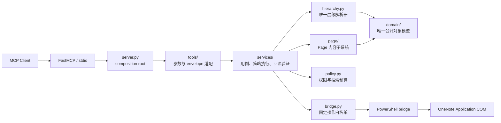
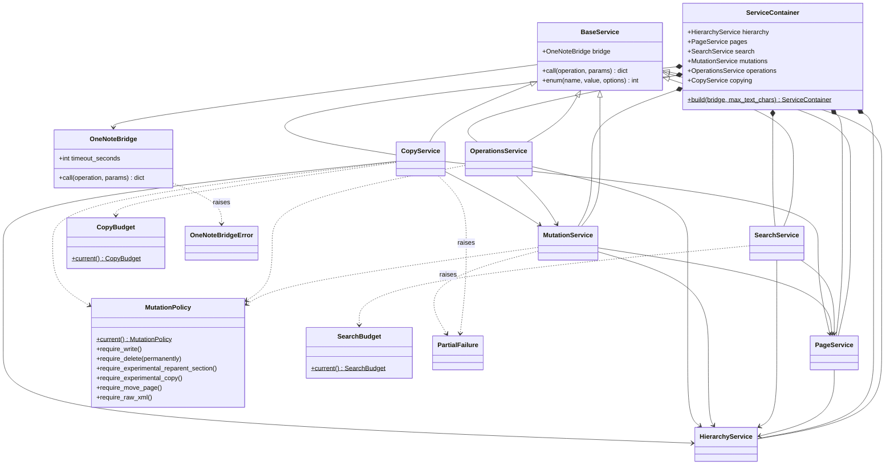
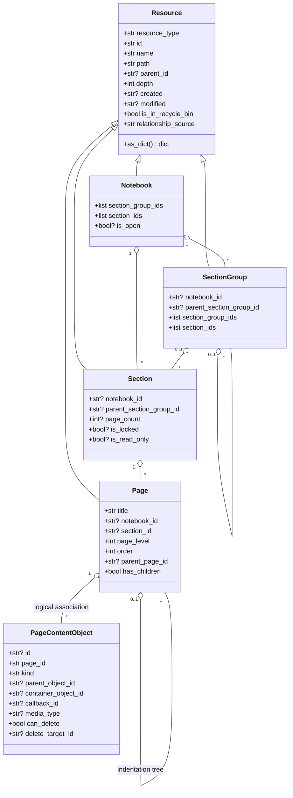
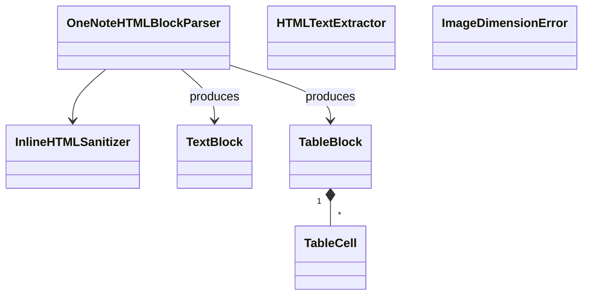
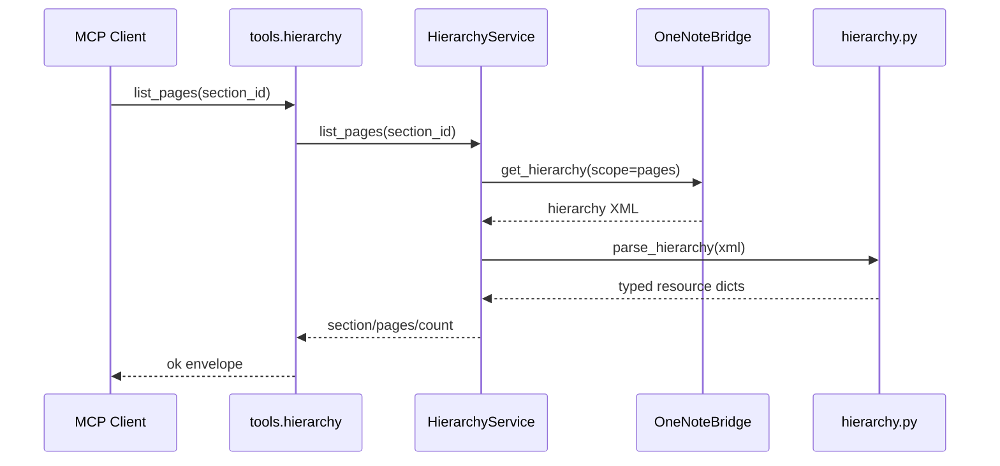
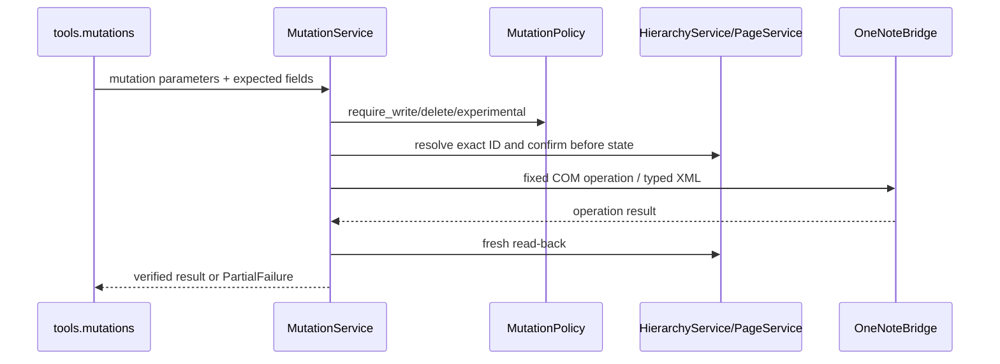

# Local OneNote MCP 当前设计架构

> 状态：当前实现态
> 更新日期：2026-08-04
> 相关契约：[对象模型](object_model.md) · [层级解析器](hierarchy_parser.md) · [工具参数与返回格式](tool_contracts.md)

## 1. 架构结论

项目采用“装配入口 → MCP 工具适配层 → 应用服务层 → mapper/领域模型 → COM bridge”的分层结构。`server.py` 只创建对象和注册工具；业务规则不再放在 server 中。



必须保持的边界：

- `domain/` 是 Notebook、SectionGroup、Section、Page、PageContentObject 的唯一静态模型；服务层和工具层不得复制 DTO。
- `hierarchy.py` 是层级 XML 的唯一解析入口；`page/` 只解析 Page 内容 XML。
- `tools/` 只做同步服务到 async MCP 的适配和统一响应，不直接调用 COM。
- `services/` 承担用例编排、策略检查、XML 构造调用和 mutation 回读验证。
- `bridge.py` 不理解领域对象，只接受固定 operation 和 JSON 参数。

## 2. 源码结构与依赖方向

```text
src/local_onenote_mcp/
├─ server.py                 依赖装配与 FastMCP 启动
├─ tools/
│  ├─ context.py             当前 ServiceContainer 绑定
│  ├─ responses.py           ok/error/caught/invoke envelope
│  ├─ system.py              健康检查、标识符、特殊目录
│  ├─ hierarchy.py           层级 List/Get/Query/Path/Tree
│  ├─ pages.py               Page 内容读取与 Search
│  ├─ mutations.py           typed Create/Update/Delete
│  ├─ copying.py             P2 Copy/Page Move
│  ├─ operations.py          Export/导航/Sync/Close
│  ├─ advanced.py            启动时可选的开发 profile
│  └─ __init__.py            默认/高级工具集合和注册
├─ services/
│  ├─ base.py                BaseService
│  ├─ container.py           ServiceContainer
│  ├─ hierarchy.py           HierarchyService
│  ├─ pages.py               PageService
│  ├─ search.py              SearchService
│  ├─ mutations.py           MutationService
│  ├─ copying.py             CopyService
│  ├─ operations.py          OperationsService
│  └─ errors.py              PartialFailure
├─ domain/
│  ├─ resource.py            Resource
│  ├─ notebook.py            Notebook
│  ├─ section_group.py       SectionGroup
│  ├─ section.py             Section
│  ├─ page.py                Page
│  ├─ page_content.py        PageContentObject/content_objects
│  └─ __init__.py            对象模型 facade
├─ hierarchy.py              纯层级 XML mapper 与定位函数
├─ page/
│  ├─ parser.py              Page XML 读取
│  ├─ formatting.py          plain/HTML/Markdown 规范化
│  ├─ builder.py             UpdatePageContent XML 构造
│  ├─ images.py              图片尺寸读取与等比换算
│  ├─ models.py              Page 格式化内部块模型
│  └─ __init__.py            Page 子系统 facade
├─ bridge.py                 PowerShell/COM infrastructure adapter
├─ policy.py                 MutationPolicy 与 SearchBudget
├─ settings.py               server 名称、超时和文本长度配置
└─ constants.py              COM enum、namespace、schema
```

允许的主依赖方向为：

```text
server → tools → services → hierarchy/page/policy → domain
                           └──────────────────────→ bridge → COM
```

反向依赖被禁止。例如 `domain/` 不导入 service，`hierarchy.py` 不导入 bridge 或 MCP，service 不导入 tool。

## 3. 类关系总览

### 3.1 应用与基础设施类



| 类 | 所在模块 | 职责 |
| --- | --- | --- |
| `ServiceContainer` | `services.container` | 构造并持有共享 bridge 上的六个 service；表达显式依赖。 |
| `BaseService` | `services.base` | 提供 bridge 错误归一化和 enum 校验。 |
| `HierarchyService` | `services.hierarchy` | 获取 typed snapshot，完成 List/Get/Query/Path/Tree、ID/路径解析、层级更新 XML。 |
| `PageService` | `services.pages` | 读取 Page XML/text/object/binary，确认 Page，计算内容摘要。 |
| `SearchService` | `services.search` | 执行有显式 scope 和硬预算的 local scan 或 OneNote index 搜索。 |
| `MutationService` | `services.mutations` | typed 创建、修改、删除；策略检查、乐观确认和操作后回读均在此。 |
| `CopyService` | `services.copying` | 无状态 Copy 计划、四层递归复制、Page XML 保真报告和 Move 删除门。 |
| `OperationsService` | `services.operations` | 特殊目录、超链接、父级、导出、导航、同步、关闭及高级应用操作。 |
| `MutationPolicy` | `policy` | 从环境变量生成不可变权限快照。 |
| `SearchBudget` | `policy` | 从环境变量生成不可变搜索预算。 |
| `CopyBudget` | `policy` | 限制 Copy 的对象/Page 数、完整 XML 字节和计划/执行时间。 |
| `OneNoteBridge` | `bridge` | 通过临时 JSON 与固定 PowerShell 脚本执行白名单 COM 操作。 |
| `PartialFailure` | `services.errors` | 携带非原子多步 mutation 已完成步骤。 |
| `OneNoteBridgeError` | `bridge` | 表达 PowerShell、COM、超时和响应错误。 |

`ServiceContainer.build()` 的创建顺序体现了依赖：先 `HierarchyService`，再 `PageService`，随后 `SearchService` 和 `MutationService`，最后创建依赖 mutation 的 `OperationsService` 与 `CopyService`。

### 3.2 领域类



这些 dataclass 只在 mapper 内表达白名单字段，再通过 `as_dict()` 进入服务和 MCP 边界。Page 的公开名称是 `title`，其 `as_dict()` 不保留继承来的 `name` alias。`PageContentObject` 属于 Page 内容快照，不进入层级树。

### 3.3 Page 内部类



- `InlineHTMLSanitizer` 删除不安全 tag/attribute/style。
- `OneNoteHTMLBlockParser` 把 HTML 转成有序文本块和表格块。
- `HTMLTextExtractor` 从 Page XML 的内嵌 HTML 提取可见文本。
- `TextBlock/TableCell/TableBlock` 是 builder 使用的内部格式模型，不是公开对象模型。
- `ImageDimensionError` 表达不受支持或损坏的图片头。

## 4. MCP 工具适配层

`tools/` 当前由模块级 async 函数组成，不引入“工具类”。`tools.context` 在启动时绑定一个 `ServiceContainer`；每个工具读取对应 service，调用同步用例，再由 `responses.invoke()` 转为统一 envelope。

| 工具模块 | 默认注册数 | 调用的 service |
| --- | ---: | --- |
| `tools.system` | 3 | hierarchy、operations |
| `tools.hierarchy` | 11 | hierarchy |
| `tools.pages` | 6 | pages、search |
| `tools.mutations` | 16 | mutations |
| `tools.copying` | 7 | copying |
| `tools.operations` | 7 | operations |
| 合计 | 50 | — |

`tools.advanced` 另有 7 个开发 profile 工具，仅当进程启动时 `LOCAL_ONENOTE_ENABLE_RAW_XML=true` 才注册。注册并不代表取得写权限；service 仍会再次执行 write/delete/raw policy。逐工具合同见 [Advanced/低层操作](advanced_operations.md)。

响应映射：

| Python 异常 | MCP `code` |
| --- | --- |
| `ValueError` | `validation_error` |
| `PermissionError` | `policy_disabled` |
| `PartialFailure` | `partial_failure`，附带 `partial/completed_steps` |
| 其他 service/bridge 异常 | `backend_error` |

## 5. 关键调用链

### 5.1 只读层级查询



### 5.2 typed mutation



Mutation 使用 ID 作为主键；`expected_name/expected_title`、父 ID 和可选 modified 是乐观确认字段。写后必须验证同 ID、名称、父级、顺序或内容摘要。`replace_page_body` 是明确的非原子多步操作。

### 5.3 Search

- `local_scan`：typed hierarchy → 显式 scope → 候选数预检查 → 在字符/耗时预算内顺序读取 Page。
- `onenote_index`：COM FindPages → 局部 XML → 用完整 typed catalog hydration → 可选正文 snippet。
- 两个后端不会静默 fallback。

## 6. 运行时生命周期与并发

- `server.py` 创建一个 `FastMCP`、一个 `OneNoteBridge` 和一个 `ServiceContainer`，随后注册工具并运行 stdio。
- service 实例共享同一个 bridge；当前没有 repository 或 hierarchy cache。
- 每个 bridge 调用启动非交互 PowerShell，并在该进程中创建 OneNote COM 对象。
- 工具函数是 async transport 接口，service 和 bridge 当前为同步阻塞执行。
- mutation 回读使用有限次数的同步轮询；搜索顺序读取 Page，不并行调用 COM。

## 7. 测试与写入隔离

| 测试文件 | 主要边界 | 自动运行权限 |
| --- | --- | --- |
| `test_domain.py` | dataclass 序列化 | 纯内存、只读 |
| `test_hierarchy.py` | 层级 XML mapper | 纯字符串、只读 |
| `test_page.py` | Page parser/formatter/builder | 纯内存/本地 fixture、只读 |
| `test_policy.py` | policy/budget | 纯环境快照、只读 |
| `test_server.py` | tool/service 集成 | 默认只读；写合同标记 `write_contract` |

本会话与默认自动验证仅运行 `pytest -m "not write_contract"`。真实 COM mutation 以及 `write_contract` 流程只能按 [隔离 mutation 验证](../dev/isolated_mutation_validation.md) 人工触发。

## 8. 已知演进边界

1. 完整层级快照会在一次复杂用例中被多次读取；若引入缓存，mutation 前确认和写后回读必须绕过缓存。
2. `tools.context` 是进程级 service 绑定，适合当前单 server 实例；多租户或多 bridge 配置需要改为显式 MCP context 注入。
3. PowerShell/COM 每次调用的延迟尚无正式基准；长驻 broker 必须先验证 COM apartment、超时和恢复语义。
4. 字典是当前 MCP 边界格式；新增 DTO 时必须复用 `domain/` 的字段契约，不能建立第二套对象模型。
5. Section Reparent 已通过用户隔离验收，仍由独立实验开关保护且只允许同一 Notebook。
