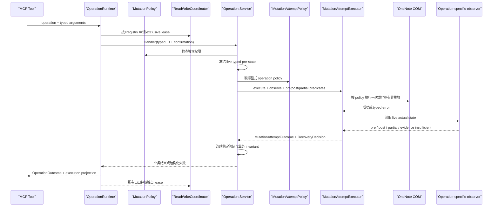

# OneNote Mutation Readiness 状态模型与调用设计

> 状态：有界 mutation attempt 原语与 Reparent 四态对账已实现，并由 operation-wide Runtime/Registry 组合
> 更新日期：2026-08-15
> 适用范围：Local OneNote MCP 的生产 mutation tools；manual-validation 的 disposable lifecycle 只作为受控特例

本文定义 OneNote COM mutation 的 readiness 边界、状态名称和调用顺序。公开参数、返回 envelope、HRESULT 与通用 reconciliation 仍以 [`tool_contracts.md`](tool_contracts.md) 为准，总体 service/coordination 架构以 [`architecture.md`](architecture.md) 为准。

## 1. 平台限制：执行前没有可证明的 `mutation_ready`

OneNote COM 没有提供只读的 `CanUpdateHierarchy`、flush-complete token 或等价接口。生产工具在调用 `UpdateHierarchy` 前，无法通过一个无副作用探针证明目标已经进入底层 mutation 可接受的持久化状态。

以下观察都不能单独证明 `mutation_ready`：

- `SyncHierarchy` 返回成功；它只证明请求被接受；
- 连续多次 `GetHierarchy` 得到相同 typed hierarchy；
- Page XML、正文或内容对象可以完整读取；
- `.one`/`.onetoc2` 文件存在、大小或 mtime 发生变化；
- 等待固定时长；
- `OpenHierarchy` 返回 object ID；
- 提交 no-op `UpdateHierarchy`；它本身就是 mutation，不能作为安全探针。

因此生产 tool 不得返回或内部推导虚假的 `mutation_ready=true`。正确问题不是“怎样提前确定一定成功”，而是“现有证据是否足以安全尝试一次，以及执行后怎样确定真实结果”。

## 2. 状态模型

| 状态 | 可证明内容 | 不可推导内容 |
| --- | --- | --- |
| `logical_ready` | 精确 typed ID、类型、活动态、parent、同 Notebook、confirmation、scope、内容基线与 hierarchy bookend 均通过 | 底层源文件已经提交；下一次 native mutation 一定成功 |
| `execute_attempted` | mutation 调用已经发出一次 | COM 返回异常等于未应用；COM 返回成功等于 postcondition 已成立 |
| `applied` | 完整 operation-specific postcondition 和 invariant 已由 live evidence 证明 | 后端调用过程没有抛错 |
| `not_applied` | 完整 frozen pre-state 保持不变，且没有 fresh/removed/remapped/partial 对象 | 可以无条件重试 |
| `partially_applied` | 已出现部分 topology、identity、内容或前置 mutation 变化，但完整 postcondition 不成立 | 重放整个操作是安全的 |
| `indeterminate` | 证据不足、读取失败、目标歧义或状态震荡，无法证明 pre/post/partial 中任一完整状态 | mutation 未发生 |

允许的抽象状态流为：

```text
logical_ready
  → execute once
  → applied | not_applied | partially_applied | indeterminate
```

GUI preflight、稳定 hierarchy 与完整内容基线都只属于 `logical_ready` 的证据，不能升级为绝对的 mutation-ready 保证。最终结果只能由 execute 后的 live reconciliation 与 invariant validation 确定。

## 3. 生产 mutation 的正确调用设计

生产 mutation tool 应按以下顺序工作：

1. **Logical preflight**：使用 live、非缓存状态确认精确 ID、类型、活动态、parent、同 Notebook、confirmation、scope、预算和完整保护基线；该阶段只能声明 `logical_ready`。
2. **Execute once**：调用一次业务 mutation。存在副作用或 identity remap 的操作默认不得把 timeout、同步错误或未知 HRESULT 当成重放许可。
3. **Reconcile actual state**：无论 execute 返回成功还是异常，都以 operation-specific observer 判断 `applied/not_applied/partially_applied/indeterminate`；异常不是“未应用”的证据。
4. **Converge and validate**：`applied` 仍须满足连续稳定 hierarchy、完整内容 evidence、bookend 和无关对象 invariant；读取瞬态错误只允许重读 evidence，不重放 mutation。
5. **Return actionable state**：成功与失败都只返回 content-free、Agent 可行动的结果；partial/indeterminate 明确禁止盲目重试。

### 3.1 控制面对象与定位

TODO 029 交付的是一个 bounded attempt vertical slice，不是完整 Operation Runtime。纳入范围的 operation 将其 principal backend attempt 交给下列对象；业务 service 仍可以拥有 attempt 前后的 operation-specific 步骤：

| 对象 | 定位 | 不负责什么 |
| --- | --- | --- |
| `MutationPolicy` | 权限门禁：Writes/Delete/实验能力是否被本机配置显式授权 | 不判断 COM 是否 ready，不判断操作结果 |
| `ReadWriteCoordinator` | 并发边界：从 confirmation 到最终回读持有进程内独占 lease | 不提供跨进程事务，不解释业务 postcondition |
| `MutationAttemptPolicy` | attempt 规约：声明 replay、identity、observer、partial boundary 和禁止的 backend operation | 不描述完整 operation 阶段，不执行 COM，不读取 OneNote |
| `MutationAttemptExecutor` | attempt 执行与裁决者：按规约限制 execute attempts，驱动共享 reconciliation，并把 typed evidence 转成统一 outcome | 不拥有 admission/coordination/saga，不猜测业务对象是否真的移动、删除或改名 |
| operation-specific observer | 事实观察者：用 live typed evidence 判定 exact pre-state、完整 post-state 或 partial state | 不决定权限，不自行重放 mutation |
| `MutationAttemptOutcome` | attempt 结果账本：固化 attempts、replay、observed outcome、阶段和 identity policy | 不等同 operation-wide outcome；不包含正文、XML、binary、路径或原始参数 |
| `RecoveryDecision` | 恢复建议：从四态与 typed error 推导调用方下一步 | 不从错误消息字符串或 wrapper HRESULT 猜测 |

更准确地说，029 只抽取了 mutation principal attempt 的静态 policy、执行裁决、observer 接口与结果账本。当前 Tool→attempt policy inventory 已迁移到 canonical [`OperationRegistry`](operation_runtime.md)，不再维护第二份 `MUTATION_ATTEMPT_POLICY_BINDINGS`。Registry 负责静态 operation policy，`OperationRuntime` 负责 admission、coordination、deadline、全 operation outcome、backend-call accounting 与 saga；029 executor 继续只计算 principal attempt，并由 Runtime 从嵌套 reconciliation 吸收其 outcome。

### 3.2 对象协作流程



executor 不把 COM success 当成完成，也不把 COM exception 当成未发生。它只消费 observer 给出的事实。虽然基础原语支持“policy 明确允许 + 完整 exact pre-state + typed transient”时至多重放一次，但当前生产 policy 全部为 `never`；读证失败最多重读 evidence，不重放 mutation。

### Page Reparent 专项约束

`reparent_page` 允许 Page 与内容对象发生一对一 ID remap，默认 root-only 路线还可能先执行 descendant promotion。因此：

- 主 Reparent `UpdateHierarchy` 只调用一次，`mutation_replayed=false`；
- 如果 descendant promotion 已完成而主 Reparent 失败，整体状态至少是 `partially_applied`，不能降级为 `not_applied`；
- execute 抛错但完整 destination、ID map、scope、内容和无关对象 postcondition 均成立时，可以按 `applied` 成功返回，并附 `execute_error_reconciled=true`；
- 只有完整 frozen pre-state、目标 Section 无 fresh candidate、无 ID remap、无 promotion 和无其他变化时，才能判为 `not_applied`；
- 目标候选不唯一、read-back 不完整或 bookend 不稳定时必须判为 `indeterminate`。

## 4. Lifecycle 与业务 mutation 的权限边界

生产 `reparent_page` 不得为了建立 readiness 而隐式调用：

- `SyncHierarchy` 作为完成证明；
- `CloseNotebook` 或 reopen；
- filesystem `.one` readiness probe；
- 固定 sleep；
- no-op mutation。

自动关闭用户 Notebook 会影响 UI、触发同步和 ID 重建，并把“移动一个 Page”的副作用扩大到 Notebook lifecycle。若未来产品需要显式 Notebook checkpoint，它必须是单独设计、单独授权、精确 confirmation 且明确披露 ID remap/关闭重开影响的 lifecycle 能力，不能隐藏在任意业务 mutation 中。

Manual-validation 只操作本次新建的 disposable Notebook，因此 Recipe 可以静态声明持久化 checkpoint。该特例用于构造可靠测试输入，不扩展生产 tool 权限，也不能推广为所有 Notebook 或所有 OneNote 版本的普遍要求。

## 5. HRESULT、重试与恢复建议

错误分类使用最内层 COM HRESULT；PowerShell wrapper HRESULT、异常深度和最内层异常类型只作为 content-free 诊断。不能仅凭 wrapper `0x80131501` 决定重试或要求用户关闭 Notebook。

| Reconciliation | Typed evidence | 调用方动作 |
| --- | --- | --- |
| `applied` | 完整 postcondition 成立 | 成功；若 execute 抛错，标记 reconciled success |
| `not_applied` | 精确 pre-state + not-yet-synchronized/file unavailable | 可建议用户在 OneNote 中显式关闭并重开后重新发起新调用 |
| `not_applied` | modal UI | 关闭阻塞对话框后重新发起新调用 |
| `not_applied` | 确定性非法请求 | 修正输入，不建议原样重试 |
| `partially_applied` | 任意 | 禁止重放；返回 current IDs/位置和人工恢复要求 |
| `indeterminate` | 任意 | 禁止重放；先用只读 Tool 重新查询实际状态 |

通用 reconciliation 基础设施允许个别真正幂等的 mutation 在严格条件下重试，不代表 Page Reparent 获得重放许可。每个 operation 必须独立声明 replay policy；未知、partial 或 identity-remapping mutation 默认不重放。

## 6. Bounded attempt policy 矩阵

本轮只收拢一个有界 principal execute step。审查发现多个 observer 只冻结了 digest 或目标局部状态，不能证明完整 operation pre-state，因此所有当前生产 policy 统一为 `replay=never`。基础原语中的 conditional replay 仅保留给未来能够冻结并验证完整 exact pre-state 的显式策略；登记前必须有独立合同与故障注入测试。

| Operation | Identity policy | Observer / 完整成功事实 | Replay | Partial boundary |
| --- | --- | --- | --- | --- |
| `rename_page` | ID 保持 | 同一 Page 的目标标题 | never | 目标消失或其他受保护语义改变 |
| `rename_resource` | ID 保持 | 同一资源的新名称和原 parent | never | 目标消失或 parent 改变 |
| `reorder_page` | ID 保持 | Section 内完整 Page 顺序 | never | sibling identity 集合改变 |
| `reorder_section` | ID 保持 | parent 下 Section 顺序与受保护子树 | never | 直属 child identity 集合改变 |
| `append_page_content` | Page ID 保持，内容对象可变 | COM success 后 Page 内容摘要离开 frozen pre-state 并稳定 | never | Page identity 不可确认；execute error 后仅摘要变化不足以证明请求内容已应用，判为 indeterminate |
| `add_page_image_from_file` | Page ID 保持，内容对象可变 | COM success 后 Page 内容摘要离开 frozen pre-state 并稳定 | never | Page identity 不可确认；execute error 后仅摘要变化不足以证明请求图片已应用，判为 indeterminate |
| `delete_page_content_object` | 指定内容对象消失且其余对象集合保持 | live content object ID 集合精确等于 frozen set 减目标 | never | Page identity 改变，或任何非目标内容对象 ID 漂移 |
| typed `delete_*`（内部 `delete_hierarchy`） | 目标退出活动层级 | typed resource activity | never | 永久删除只到回收站或状态不完整 |
| `close_notebook` | Notebook 退出 open 集合 | typed open state | never | open state 无法确定 |
| `reparent_page` | Page ID 允许一对一 remap | 完整 destination、唯一 Page ID map、scope、层级关系、无关对象和 hierarchy bookend | never | 任意 hierarchy topology/identity/promotion 变化 |
| `reparent_section` | ID 保持 | 完整 destination、子树 hierarchy、无关对象和 hierarchy bookend | never | 任意 hierarchy topology/identity 变化 |
| `reparent_section_group` | ID 保持 | 完整 destination、递归子树 hierarchy、无关对象和 hierarchy bookend | never | 任意 hierarchy topology/identity 变化 |

三类 Reparent 的主 `UpdateHierarchy` attempt 还声明禁止 `sync_hierarchy`、`close_notebook`、`open_hierarchy` 与 filesystem readiness probe。Page root-only 路线可能在 principal attempt 前执行 operation-specific descendant promotion；该步骤不计入 `mutation_attempts`，但会进入 operation failure 的 `completed_steps`。一旦 promotion 已发生，之后的失败整体至少是 `partially_applied`。

## 7. 当前实现与暂不收拢的边界

当前已经成立：typed confirmation、进程内写协调、统一 bounded-attempt policy/executor/outcome、连续稳定 read-back、Reparent 成功/异常共享 observer 的四态对账、execute-error reconciled success、最内层 HRESULT 恢复建议，以及生产 Reparent 不依赖 `SyncHierarchy`、自动 close/reopen 或逐 Page XML read-back。生产 Reparent 的保证边界是 hierarchy；Manual validation 则对每次正向与恢复调用保留逐 Page 内容/对象比较，并检查 reconciliation 响应和 bridge audit。

以下操作刻意不交给 029 principal-attempt executor，但仍在 Operation Registry 中具名登记：

- Create：包含 allocated identity、可能 remap 与创建后内容写入；
- `replace_page_body`：先删除多个内容对象再写入，明确非原子；
- Copy/Move：分配、内容重建、拓扑恢复、保真验证和可选源删除组成多阶段 saga；
- SectionGroup Reorder：当前后端能力明确不支持；
- `request_notebook_sync`、open、export、navigate：不是本轮定义的 bounded mutation attempt 生态。

它们继续使用 operation-specific 编排；Runtime 的统一不机械改写多阶段恢复语义，也不把 attempt executor 推广到非 mutation tool。Create/Replace 以 operation-specific policy 登记，Copy/Move 以 saga 登记，Sync/Open/Publish/Navigate 则使用 Lifecycle、Filesystem Effect 或 UI Effect Strategy。[TODO 029](../todo/029_mcp_mutation_readiness_and_reconciliation_hardening.md) 已通过完整自动化回归，以及用户确认的 Reparent fresh/cache、canonical Rename、扩展 `onenote-convergence` 和 production Close lifecycle handoff 真实证据闭合；当前组合边界以 [`operation_runtime.md`](operation_runtime.md) 为准。
