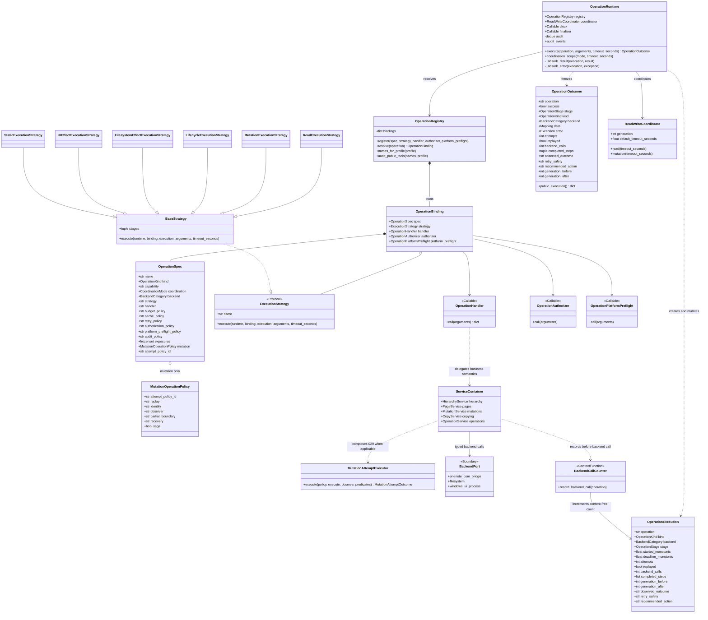
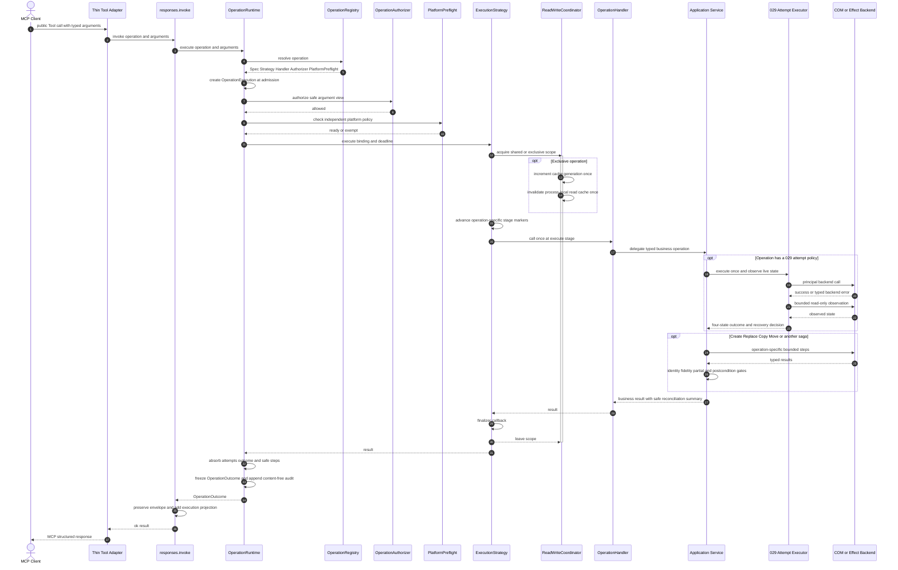
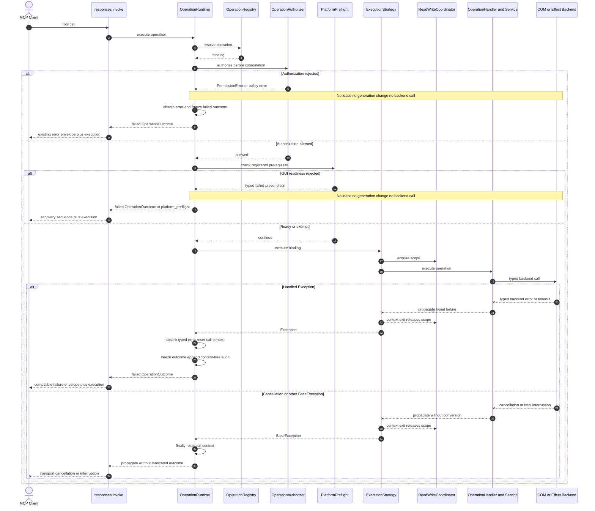

# Operation Runtime 操作执行控制面

> 状态：当前实现态
> 更新日期：2026-08-17
> 相关契约：[当前架构](architecture.md) · [公开 Tool 契约](tool_contracts.md) · [Mutation readiness](mutation_readiness_and_call_design.md)

## 1. 定位与依赖方向

Operation Control Plane 是所有生产 MCP Tool 共用、与 transport 无关的执行控制层；核心运行对象是 `OperationRuntime`。它统一准入、执行分类、进程内协调、deadline、cache generation、backend-call 计数、安全审计、错误出口和结果投影，但不解释 OneNote Page 正文、raw XML、Copy fidelity 或业务拓扑。

```text
MCP Tool adapter
  → tools.responses.invoke(operation, arguments)
    → OperationRuntime
      → OperationRegistry: OperationSpec + Strategy + Handler + policies
        → existing application Service
          → backend port
            → OneNote COM bridge | filesystem | Windows UI/process
```

允许的依赖方向是 `tools → runtime/registry → services → bridge/backends`。公开 Tool adapter 不能直接取得 `ServiceContainer`、调用 Service/Bridge、选择 shared/exclusive lease，或通过 `mutation=True` 之类的布尔参数编排控制协议。Service 也不导入 Tool。

控制面只处理如何执行；数据面仍由既有 Service 处理具体业务：

| 控制面拥有 | Service/数据面拥有 |
| --- | --- |
| operation 查找、profile 审计、kind、coordination、deadline、generation、Strategy、Outcome、content-free audit | typed ID、confirmation、hierarchy/Page 语义、policy 细节、Copy fidelity、observer、reconciliation、convergence、postcondition |

首版是进程内控制面，不提供跨 MCP 进程事务、OneNote 全局锁、后台 daemon 或持久 operation handle。

## 2. 类建模图

下图描述当前实现中的对象所有权与调用依赖。`OperationRegistry` 拥有静态 binding；`OperationRuntime` 为每次调用创建短生命周期的 `OperationExecution`，最终冻结为 `OperationOutcome`。Handler 是 Registry 绑定的 callable，不是另一个公开 Tool 层；它把业务执行委托给既有 `ServiceContainer`。Runtime 不直接依赖具体 Page、hierarchy、Copy 或 effect Service。



关系中最重要的边界是：

- `OperationRuntime` 只认识 Registry binding、协调、deadline、计数和安全投影，不认识正文或 Copy fidelity；
- `MutationAttemptExecutor` 是部分 mutation Handler 组合的 029 principal-attempt 原语，不是 Runtime 的父类，也不适用于 Replace、Create、Copy/Move 等 operation-wide saga；
- `OperationExecution` 是单次调用内的可变控制面状态，只通过 `ContextVar` 暂时绑定给 content-free backend-call counter；调用结束后只生成不可变语义的 `OperationOutcome` 和 allowlist audit；
- `OperationOutcome.data` 承载 Service 返回值，但 `public_execution()` 仅投影固定控制字段，不把业务 payload 写入 Runtime audit。
- `StaticExecutionStrategy` 是当前代码中的预留实现；当前 53 项 production Registry 没有 `static` binding，实际生产分类仍是 Read、Mutation、Lifecycle、Filesystem Effect、UI Effect 五类。

## 3. 时序图

### 3.1 成功路径

下图以 mutation 为最完整路径；Read、Lifecycle、Filesystem Effect、UI Effect 使用同一入口，但 Strategy 只标记各自适用的阶段。当前 `_BaseStrategy` 在 `execute` 阶段调用一次 Handler；具体 live preflight、principal attempt、observer、reconciliation、convergence 和 postcondition 由 operation-specific Service 在这次 Handler 调用内完成，然后由 Runtime 吸收安全摘要。图中的阶段推进不表示 Runtime 重新实现一套业务状态机。



### 3.2 授权、平台前置条件拒绝与执行异常

授权先于独立的平台前置条件，二者都发生在协调 lease、cache generation 和 backend 调用之前；因此 authorization 或 GUI readiness 拒绝都不会产生 backend side effect。授权通过后的 `onenote_gui_ready` 只负责 native check-only readiness，不开启 GUI、不解释七类 gate。Handler、backend、reconciliation 或 deadline `Exception` 必须依靠 coordination context 退出释放 lease，Runtime 再把 typed error 与 content-free `execution` 合并到既有失败 envelope。取消等 `BaseException` 同样释放 lease 并重置调用上下文，但继续向上传播，不伪造一个已完成的 MCP envelope。

当前七类公开 gate 是 Create、Writes、Deletes、Organize、Local File IO、UI Control 与 Notebook Lifecycle。Registry 使用显式组合 policy：容器 Create=`create`，Page Create 与 Copy=`create_write`，Move=`create_write_delete`；旧 `LOCAL_ONENOTE_ENABLE_COPY` 不参与 `MutationPolicy`，也不是兼容 alias。组合中任一 gate 缺失都会停在 authorization，保持 `backend_calls=0`。



这两条路径共同保证：authorizer fail-closed、exclusive generation 只推进一次、backend call 只计数不留参数、异常不泄漏 lease、transport envelope 与 Runtime outcome 分层。

## 4. Canonical Registry

`operation_catalog.build_operation_registry()` 是生产 operation inventory 的唯一权威。每个 operation 恰好登记一个：

```text
OperationSpec + ExecutionStrategy + OperationHandler
```

`OperationSpec` 固定记录：`name/kind/capability/coordination/backend/strategy/handler/budget_policy/cache_policy/retry_policy/authorization_policy/platform_preflight_policy/audit_policy/exposures`。Authorization 与 platform preflight 分别绑定 callable；改变一个 policy 不会隐式改变另一个。Mutation 还必须登记 operation-specific 的 authorization、attempt policy、replay、identity、observer、partial boundary、recovery 和 saga 属性；缺少任一 mutation policy 或 authorization policy 会在构造 Registry 时 fail closed。

当前 production inventory 为唯一 User profile 53 项；advanced profile 为空，Registry 中也没有隐藏的 advanced binding。启动时 Registry 与 `tool_surface.py` 的冻结顺序、分类及实际 Tool 集合做精确双向审计；重复 operation、未注册 Tool、profile 错配或额外 operation 都阻止启动。五项 Internal & Incubating capability 和 forbidden set 不参与 Tool 注册；内部 raw safety gate 也不改变 exposure。

## 5. Operation 分类与阶段

固定阶段词汇为：

```text
admission → authorization → platform_preflight → coordination
          → preflight → execute → observe → reconcile
          → converge → postcondition → finalize
```

不是每类操作都使用 mutation 状态机：

| Kind | Strategy 阶段 | 典型操作 | 完成语义 |
| --- | --- | --- | --- |
| `read` | execute | Get/List/Query/Expand/Search | shared lease 下完成读取；不做 mutation reconciliation。 |
| `mutation` | preflight/execute/observe/reconcile/converge/postcondition | Create、Update、Rename、Reorder、Reparent、Copy/Move、Delete | exact live preflight 后按 operation policy 执行；对账和 postcondition 决定结果。 |
| `lifecycle` | preflight/execute/observe | Sync、Close | 按该操作可观察性表达；不能把 Sync accepted 写成 completed。 |
| `filesystem_effect` | preflight/execute/postcondition | Publish | 使用文件系统结果，不套用 OneNote identity。 |
| `ui_effect` | preflight/execute | Navigate | 只证明 action accepted，不声称 OneNote 持久状态改变。 |

Read 使用 shared lease；当前 OneNote mutation 与 lifecycle 使用 exclusive lease。Runtime 在取得 lease 前先执行 Registry authorizer，再执行独立的 platform preflight。所有需公开 gate 的 operation 除 `launch_onenote_gui` 外都显式登记 `onenote_gui_ready`；纯 read、`health_check` 与恢复入口 launch 登记 `none`。任一拒绝都不会调用 backend 或推进 cache generation，Service 内原有 policy 检查继续作为纵深防御。Coordinator 是 writer-preferring、获取有界，并在每次 exclusive operation 进入时只增加一次 cache generation、调用一次 invalidator。Handler、deadline、coordination、reconciliation、finalize 或 `BaseException` 出口都必须释放 lease；它不约束另一个 MCP 进程或用户直接在 OneNote Desktop 中编辑。

## 6. 029 principal attempt 与 operation outcome

TODO 029 的 `MutationAttemptPolicy/Executor/Outcome` 是单次 principal attempt 原语，不是完整 Operation Runtime。036 的组合关系是：

```text
MutationExecutionStrategy
  → operation live preflight
  → MutationAttemptExecutor (029: execute-once + four-state reconciliation)
  → operation convergence/postcondition
  → OperationOutcome
```

Registry 取代旧的独立 Tool→attempt-policy inventory。当前生产 attempt policy 均为 `replay=never`；COM error 后 observer 可以证明 `applied`，精确 unchanged pre-state 则要求新调用，partial/indeterminate 要求只读检查或人工恢复。Runtime 从 Service 返回的嵌套 `reconciliation` 吸收 `mutation_attempts/mutation_replayed/observed_outcome/retry_safety/recommended_action`，但不复制第二套 attempt 状态机。

Copy/Move 是 operation-wide saga：内部 planning、allocated/resolved/remapped identity、fidelity、Create/Writes authorization 后的 Copy verification、source-delete gate 和 completed steps 留在 `CopyService`；Runtime 只投影安全的 operation 状态。Agent 不保存 plan、ID map 或 replay 状态。

## 7. Outcome 与公开 response

`OperationOutcome` 与 MCP transport 无关，记录：

```text
operation, success, stage, kind, backend,
attempts, replayed, backend_calls, completed_steps,
observed_outcome, retry_safety, recommended_action,
generation_before, generation_after
```

原有成功/失败 envelope 保持兼容，每次 Tool 调用都增加稳定的 `execution` 字段：

```json
{
  "operation": "rename_section",
  "stage": "finalize",
  "kind": "mutation",
  "backend_category": "onenote_com",
  "attempts": 1,
  "replayed": false,
  "backend_calls": 4,
  "completed_steps": [],
  "observed_outcome": "applied",
  "retry_safety": "not_needed",
  "recommended_action": "none",
  "cache_generation": {"before": 12, "after": 13},
  "content_exposed": false
}
```

`backend_calls` 统计当前 operation 中通过 `BaseService.call()` 发出的 COM 调用，以及 effect Service 显式登记的 filesystem 调用；只计次数，不保留参数或 payload。`completed_steps` 只允许 `operation/status/attempt/count`。Runtime audit 采用固定长度内存队列和 allowlist projection，绝不保存原始参数、Page 正文、raw XML、binary、secret、bridge payload、对象 ID 或完整路径。

`items` Batch Mutation 的 content-free hierarchy catalog 与 effective mutation scope 是两个独立预算维度。Catalog 可包含全部已打开 Notebook，只受 `LOCAL_ONENOTE_MAX_BATCH_CATALOG_RESOURCES` 的高水位约束；无关对象不会计入 effective resource/Page 上限。预检预算拒绝发生在 principal mutation 前并保留真实 hierarchy backend-call 计数。Create/Rename/Reparent/Delete 的全部 item 成功后均追加一次整批最终 hierarchy 回读；这次回读不读取 Page 正文，失败按 `batch_final_hierarchy` partial outcome 返回且禁止自动 replay。

Strategy-specific outcome 保持真实边界：

- `request_notebook_sync` 返回 `accepted=true, complete=false, completion_observable=false`，execution outcome 为 `accepted_completion_unobservable`；
- Navigate 的 execution outcome 为 `action_accepted`；
- Publish 的 execution outcome 为 `filesystem_effect_completed`；
- Close 归 Lifecycle，但继续吸收 029 的单次 attempt 与 open-state convergence 证据。

### Manual-validation 反向依赖边界

`tests/manual_validation/` 是 MCP transport 下游的黑盒验收客户端，不是 Operation Control Plane 的一部分。Runner、Scenario Registry、fixture/cache、lifecycle 和证据核心不得导入 `operation_catalog`、`OperationRuntime/Registry/Spec`、`mutation_control`、`tools.context/responses` 或生产 `server` 对象，也不得复刻 Runtime 状态机或从 Registry 动态生成场景权限。

具名场景可以验证公开 response 中稳定、content-free 的 `execution` 字段，正如它们验证 `reconciliation`、typed item 和 Copy report；这是 transport contract 验收，不授予对 Runtime 内部对象的访问。生产非只读 Operation 与具名 scenario 的覆盖关系由上层 `tests/test_operation_runtime.py` 同时读取两个独立 catalog 后断言，依赖方向不会反转进 manual-validation。源码负合同会拒绝上述控制面导入重新进入整个 manual-validation 目录。

## 8. Copy/Move 单次调用

默认 profile 只公开：

```text
copy_page, copy_section, copy_section_group, copy_notebook,
move_page, move_section, move_section_group
```

四个旧 Plan Tool 已从所有生产 profile 移除，不保留 alias。七个执行工具不接收 `plan_digest`、operation token 或隐藏 session handle。每次调用在同一个 exclusive operation 内重新读取 live source/destination、建立调用专属内部计划并完成预算与过期 confirmation 检查。返回的 `copy_report.planning` 只是 content-free 摘要，不是下一次调用可消费的 token。

本版本不交付 Preview。`health_check.copy_move.preview.available=false` 是当前能力事实；文档不得暗示存在 `preview_copy`、`preview_move` 或任何 Preview exposure。未来若引入 Preview，必须只读、默认隐藏、与 mutation authorization 独立、非执行前置且不产生 token。

## 9. 验证边界

自动化合同必须覆盖 Registry 精确 inventory、五类 Strategy、policy 在 backend execute 前拒绝、generation 只失效一次、异常和取消释放 lease、029 outcome 组合、content-free audit、Sync/Navigate/Publish 语义，以及公开 adapter 无 Service/Bridge 旁路。

真实 OneNote 验证保持 HUMAN-GATED。Agent 只能运行 pytest 和带 `--dry-run` 的 manual-validation 命令。Copy/Move 使用七个具名场景的 fresh/cache 输入；`onenote-convergence` 覆盖 mutation/Close，并同时验证 Sync accepted-not-completed、一个 run-scoped Publish 文件结果及 Navigate action accepted。真实结果只有用户执行并确认后才可记录为通过。
