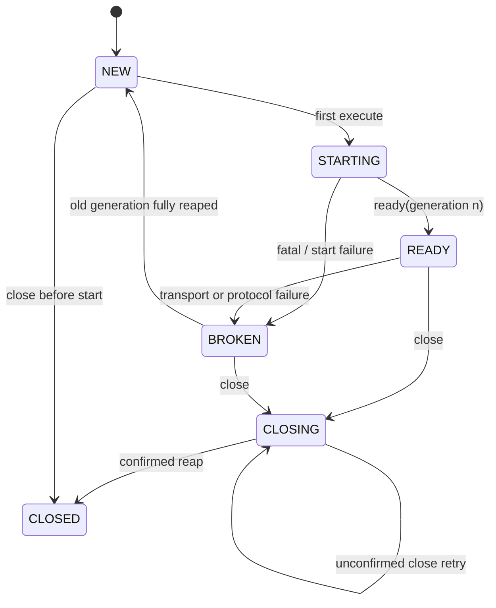
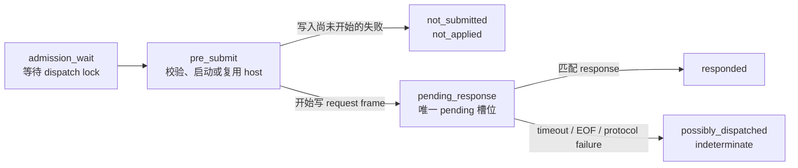

# 常驻 OneNote COM Client Bridge 状态模型

> 状态：当前实现合同<br>
> 实施跟踪：[TODO 048](../todo/048_persistent_com_client_bridge.md)<br>
> 更新日期：2026-08-22

## 1. 适用范围与当前边界

本文定义当前生产 bridge 中，**client 生命周期**和**发往 OneNote backend 的单个请求**如何建模。它约束默认的 `persistent_powershell` adapter 与显式 `one_shot_powershell` fallback adapter；未来 adapter 也必须保持相同的安全语义。

当前生产默认 adapter 是 `persistent_powershell`。显式 `one_shot_powershell` fallback 仍使用每次调用一个 Windows PowerShell 进程和临时 JSON 文件。运行依赖见 [OneNote COM Bridge 运行依赖](../dev/onenote_com_bridge_runtime.md)。真实 OneNote 验收证据仍由 [TODO 048](../todo/048_persistent_com_client_bridge.md) 跟踪。

本设计不改变公开 `OneNoteBridge.call(operation, *, _timeout_seconds, **params)`、Operation Runtime、mutation policy、reconciliation 或公开 tool response。COM proxy 永远只属于 adapter 的 execution owner，不能被 Runtime、service、tool 或调用线程跨线程/跨进程持有。

## 2. 基本术语

| 术语 | 定义 |
| --- | --- |
| adapter | 实现内部 `ComClient` 契约的 transport。v1 只有 `persistent_powershell` 与 `one_shot_powershell`。 |
| client | adapter 管理的 OneNote COM 调用能力；常驻 adapter 中对应一个 host 进程及其单一 `OneNote.Application` client。 |
| generation | 每次常驻 host 被成功创建时分配的单调标识。旧 generation 的任何迟到输出均不能归属给新 generation。 |
| sequence | 一个 generation 内严格递增的请求序号。 |
| pending | Python client 当前唯一已开始向 host 写入、正在等待匹配 response 的请求槽位。 |
| delivery state | 一个请求的最终投递结论：`not_submitted`、`possibly_dispatched` 或 `responded`。 |

## 3. 两条正交状态线

client 的可用性与单个请求是否已派发是两件不同的事：前者决定能否接收新请求，后者决定 mutation 能否安全重试。



在一个 `READY(generation n)` 中只有一个 in-flight/pending 请求；其他调用先等待 dispatch lock，尚未拥有 sequence，也没有向 backend 发送数据。

## 4. Client 生命周期

| 状态 | 含义 | `execute()` 行为 | 可达后续状态 |
| --- | --- | --- | --- |
| `NEW` | 尚未启动或已完成旧 generation 清理 | 首个调用开始启动；未写入 host 前的失败为 `not_submitted` | `STARTING`、`CLOSED` |
| `STARTING` | 正在启动 host、验证 STA 并等待 ready | 同一调用的 timeout 预算覆盖启动；尚未写 request | `READY`、`BROKEN`、`CLOSING` |
| `READY` | host 已 ready，持有一个 generation 的 COM client | 接收一个串行请求；创建单槽 pending | `BROKEN`、`CLOSING` |
| `BROKEN` | 当前 generation 已 poisoned，不能再接受请求 | 必须 kill/reap host 与 reader；不得复用 proxy 或输出 | `NEW`、`CLOSING` |
| `CLOSING` | 已拒绝新 admission，正在收尾 | 新调用为 `not_submitted`；在途调用按规则结束 | `CLOSED`、`CLOSING`（未确认时可重试） |
| `CLOSED` | owner 已显式关闭 | 所有 `execute()` 稳定失败；不得 lazy restart | 无 |

`close()` 在确认 process 已退出且 reader 已结束后才进入 `CLOSED`。未确认时停在 `CLOSING`，保留 handle，后续 `close()` 以 kill 路径重试，不得声明完成并失去收敛路径。若 host idle，adapter 可以发送 shutdown 后等待 graceful exit；若存在 pending COM 调用或本次是重试，必须直接 poison/kill host，并将该 pending 请求按 `possibly_dispatched` 收尾。

## 5. 请求状态与投递判定

请求在 Python client 内经历下列局部阶段。`admission_wait`、`pre_submit` 与 `pending_response` 是内部过程，不是公开或最终 delivery state。



### 5.1 `not_submitted`

`not_submitted` 表示 adapter 能证明请求没有开始写入 host，因此 OneNote backend 不可能收到该 operation。典型情况包括：

- dispatch lock 等待超时；
- client 已是 `CLOSING` 或 `CLOSED`；
- persistent host 的启动/ready 失败，且 request frame 尚未写入；
- 请求帧在本地因 operation-aware size limit 被拒绝；
- one-shot adapter 在临时请求文件写入或子进程创建前失败。

该状态投影为 reconciliation `not_applied`。它不表示当前调用会被 adapter 自动重发；调用者只能依照上层明确的 operation policy 另行创建调用。

### 5.2 `possibly_dispatched`

`possibly_dispatched` 表示 adapter 已经开始把 request frame 交给 host，却没有取得能与当前 generation/sequence 匹配的有效 response。此时无法证明 OneNote COM 未执行该 operation。

典型情况包括：

- 写入后等待 response 超时；
- host EOF、非零退出或 reader 失败；
- response 的 `protocol_version`、`generation` 或 `sequence` 不匹配；
- ready 后 stdout 出现非协议帧；
- response 超过大小上限或发生截断；
- one-shot 子进程启动后 timeout、EOF、非零退出且没有有效 response 文件；
- `close()` 终止存在 pending COM 调用的 host。

该状态必须投影为 reconciliation `indeterminate`。adapter 不重建 host 后重发同一个请求；尤其是 mutation 不能因“随后仍观察到 exact pre-state”而自动再次 execute。内部 timeout error 必须携带不可 replay 标记，使 `idempotent_retry_allowed()` 返回 `False`。`delivery_state` 只写入 bridge audit 和内部 error 属性，不扩大公开 tool error response。

### 5.3 `responded`

`responded` 表示 adapter 收到字段完整、且 `generation + sequence` 与 pending 请求完全相符的结构化 response。它包含 `{ok: true}` 成功和 `{ok: false}` 的 OneNote COM 失败。

响应中的 HRESULT、wrapper HRESULT、异常深度、最内层异常类型和 category 继续由 `OneNoteBridge` 统一投影为既有 typed error。`responded` 本身不表示 mutation 已应用；mutation 是否 `applied`、`not_applied`、`partially_applied` 或 `indeterminate` 仍由既有 reconciliation 和 live observation 判定。

## 6. 常驻 PowerShell adapter 的请求转发

常驻 adapter 使用明确的 framing，而非传递 COM proxy：

```text
Python bridge
  -> ComClient.execute(operation, params, timeout)
  -> request frame {protocol_version, generation, sequence, kind=request, operation, params}
  -> powershell.exe -Sta host
  -> fixed operation allowlist / OneNote.Application
  -> response frame {protocol_version, generation, sequence, kind=response, ok, data, error}
```

host 在一个 generation 内只接受严格递增的 sequence，并一次只执行一个 operation。读取与写出都受与 Python 相同的 encoded/decoded 帧上限约束；host 必须先把输入解析为 object，再校验字段类型、`generation`、`sequence` 与 operation allowlist，然后才能调用 COM。Python 只保留一个 pending 槽位；response 必须字段完整、类型正确，且 `generation + sequence` 与 pending 请求完全相符才能解除它。未知 operation、畸形帧、类型错误、sequence/generation 不匹配以及任何 ready 后的非协议 stdout 都属于 protocol failure。

host script 的 `-EncodedCommand` 本体使用 UTF-16LE Base64；request/response frame 使用 UTF-8 JSON Base64。两者独立编码，payload 不插值到 PowerShell 源代码或命令字符串。

所有 frame 都受既有 Page/XML/binary budget 推导出的 encoded 和 decoded 大小上限约束。请求侧超限发生在写入前，故为 `not_submitted`；响应侧超限发生在 backend 已可能执行之后，故为 `possibly_dispatched` 并 poison 当前 generation。

## 7. generation poison 与重建

v1 不根据结构化 COM `{ok:false}` 的 HRESULT 推测 proxy 是否可用，也不根据 HRESULT 自动 refresh。只有本地可观察的 transport 或 protocol 故障会 poison generation：timeout、EOF、非法/非协议 frame、generation/sequence 不匹配、response 截断/超限、host 非零退出或 in-flight close。

poison 的顺序固定为：

1. 阻止新 admission；
2. 将 pending 请求以 `possibly_dispatched` 结束；
3. 由 **caller 线程** kill host、关闭管道并 join reader/process。reader 线程只把状态标为 `BROKEN`，不承担物理回收，也不得把自己仍在运行视为 `reader_done`；
4. 物理回收由 `_cleanup_lock` 串行化：refresh failure 与 `close()` 不得并行 reap。报告归属按 state lock 线性化，并在提交时同时确定 cleanup owner：refresh 先提交 `BROKEN` 时必须声明 refresh owner，`close()` 观察到该 owner 时必须等待其收敛后再进入 `CLOSING/CLOSED`，不得把已提交的 `BROKEN` 改写成 `CLOSING` 并改写 refresh 的对外结果；close 先提交 `CLOSING` 则 close 负责 cleanup，refresh 返回 `rejected_closed`；
5. 仅在旧 generation 已 **confirmed reap**（process 已退出且 reader 线程已真正结束）后，才进入 `NEW`、清空 process/reader handle，并允许下一次 `execute()` 创建新 generation。

kill 后仍无法确认退出时，client 停留在拒绝 admission 的 `BROKEN`（或 `close()` 路径上的 `CLOSING`），保留 handle，不得启动下一 generation。因此“新 generation 已可用”绝不构成前一个 mutation 未发生的证据。

## 8. COM epoch 刷新

有效活动状态是 `READY(generation=n, com_epoch=k)`。`com_epoch` 嵌套于某个 host generation，只在该 generation 处于 `READY` 时有效。GUI/OneNote 进程与 COM backend **没有** PID identity 一致性要求；GUI readiness 是业务稳定性前提，不是 generation 或 epoch identity 的组成部分。

不采纳“GUI ready 后淘汰整个健康 host”。`launch_onenote_gui` 在 GUI ready（`started` 或 `already_running`）后调用非公开的 `OneNoteBridge.refresh_com_client()`：

```text
GUI readiness
→ 允许执行 refresh
→ 原 COM owner 在同一 STA host 内重建 OneNote.Application
→ 浅层 COM probe 成功
→ 提交新 com_epoch
```

这里验证的是新 COM proxy 此刻可完成浅层调用，不是它与 GUI 进程具有相同 identity。控制帧 `kind=refresh_com` 与 `shutdown` 同级，不进 operation allowlist，不携带 params 或对象 ID。one-shot adapter 与尚未启动的 persistent client 返回 `not_needed`，不为 refresh 启动 host。

两层 probe：

- Windows GUI probe：证明存在 `ONENOTE.EXE` 与可见顶层窗口，只作为是否允许尝试 refresh 的门限。
- COM probe：`$onenote.Windows` 与 `[uint64]$windows.Count` 两次只读调用必须成功。不要求 `Count > 0`，不证明 hierarchy 已加载、后续业务 API 必然成功或写操作必然收敛。`$windows` child RCW 必须在 `finally` 中 `FinalReleaseComObject`；这是长期 host 的资源卫生，不是可调用性证明。

`READY(g,k) → READY(g,k+1)` 是外部逻辑转移。host 内部实际经历 `release epoch k → $onenote = $null → activation → 浅层 probe → commit epoch k+1`。`READY(g,k)` 表示最后提交的逻辑状态；refresh 期间不保证旧 `$onenote` 仍存在；释放后不能回滚到 epoch k；activation、probe 或提交失败后只能 discard 该 generation。dispatch lock 阻止业务请求观察中间阶段，因此不新增公开 `REFRESHING` 状态。

refresh 与业务请求共用单飞约束和完整两段 admission。所有 **已发送** refresh 帧的结果经同一个 state lock 终态提交：

| 线性化胜出方 | 结果 |
| --- | --- |
| refresh 先提交 `com_epoch=k+1` | `refreshed`；随后的 close 正常进入 `CLOSING/CLOSED` |
| close 先提交 `CLOSING` | `rejected_closed`；close 负责 host cleanup |
| refresh 失败先提交 `BROKEN` 且 confirmed reap | `host_discarded`（投影 `discarded_generation`）；随后的 close 必须等待该 refresh owner 收敛，不得改写该结果 |
| refresh 失败但 kill 后无法确认退出 | `host_discard_unconfirmed`；停留 `BROKEN`，close 等待后再接管未确认 cleanup |

未发送帧的结果不得 poison host：

| 条件 | 结果 |
| --- | --- |
| dispatch-lock 等待超时或 pre-submit 失败 | `not_attempted`；状态与活动 epoch 不变 |
| 二次检查见并发 `BROKEN/NEW` 且帧未发送 | `not_attempted(reason=host_transition)` |
| 首次检查即为 `NEW`/`BROKEN` | `not_needed` |

`refreshed` 只投影活动 `generation + com_epoch`。`host_discarded` 只投影已完成 reap 的 `discarded_generation`，不得用历史 `client.generation` 暗示仍有活动 host。`not_attempted` 只投影 `reason`。refresh 成败不改写 GUI launch 成功，也不重放任何业务请求。

## 9. one-shot fallback adapter 的对应规则

one-shot adapter 没有跨调用常驻的 COM client，也没有可重用 generation；但它必须提供相同的 delivery state：

| 条件 | delivery state |
| --- | --- |
| 临时请求文件写入失败或 PowerShell 子进程创建失败 | `not_submitted` |
| 读到有效结构化 response 文件，包括 `{ok:false}` | `responded` |
| 子进程已启动后 timeout、EOF、非零退出且没有有效 response | `possibly_dispatched` |

`one_shot_powershell.close()` 是 no-op。它只能由显式 adapter 选择启用，不能在 persistent adapter 初始化或运行失败时静默接管请求。

## 10. Audit、错误与验证边界

adapter 不直接写 audit。`OneNoteBridge` 为每个 `call()` 写且只写一条 content-free 终态 audit，增加：

- `adapter`；
- `client_generation`（one-shot 可为空）；
- `delivery_state`。

`refresh_com_client()` 另写一条 content-free refresh audit：`operation=refresh_com`、`refresh_outcome`，以及按上节投影边界附带的 `generation`/`com_epoch`、`discarded_generation` 或 `reason`。它不写泛化 `ok`（`not_needed` 是冷启动的正常完成，不能标成失败），也不写 `delivery_state`，更不记录 params、XML、路径或 OneNote ID。

同 workload 双 adapter 对比必须同时收集 debug trace 与这条 audit：trace 只提供 backend call 数与耗时，上述三字段以 audit 为准。

Audit、debug trace、host stderr 或 protocol diagnostic 均不得记录 operation params、XML、Page 内容、binary、OneNote ID、路径或完整 response。协议 stdout 只接受受控 frame；stderr 必须丢弃或有界 drain，不能因未读取而阻塞 host。

自动化验证必须覆盖三种 delivery state、generation/sequence 匹配、in-flight timeout 后不重发、CLOSED 后稳定拒绝、one-shot 三态、frame limits，以及 `MutationAttemptExecutor` 不因 `possibly_dispatched` timeout 执行第二次 mutation。所有此类自动化测试使用 fake host 或 PowerShell fake client，绝不连接真实 OneNote；真实 read/mutation/restart evidence 仍由用户通过 TODO 048 的 human-gated 流程提供。

## 11. 关联

- [TODO 048](../todo/048_persistent_com_client_bridge.md)：范围、验收命令与完成定义。
- [TODO 051](../todo/051_persistent_com_client_restart_refresh.md)：OneNote 重启后的 COM epoch 刷新与 confirmed reap。
- [Operation Runtime](operation_runtime.md)：当前 Runtime、backend-call accounting、Outcome 与 audit 契约。
- [Mutation Readiness and Call Design](mutation_readiness_and_call_design.md)：当前 mutation reconciliation 与 bounded attempt 模型。
- [OneNote COM Bridge 运行依赖](../dev/onenote_com_bridge_runtime.md)：当前默认常驻 host、fallback 环境变量与运行环境约束。
